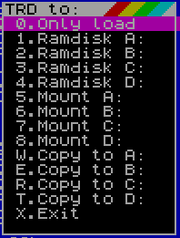
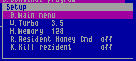
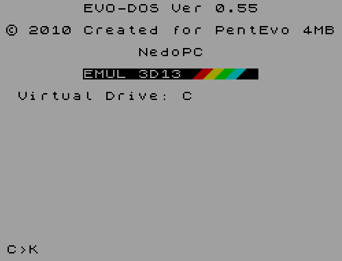

# Описание сервис прошивки «EVO Reset Service» v 0.60.05 (FE)

## Версии прошивок (ROM файл zxevo.rom и zxevo_fe.rom)

Начиная с версии 0.58.17 прошивка существует в двух вариантах ([Различия
версий DOS](#anchor-58)):

**zxevo.rom** – полностью программный эмулятор ВГ с пропатченным ПЗУ,
предназначен для работы на любой версии прошивки ФПГА, укомлектован
EVO-DOS (номер версии 0.60); 

**zxevo_fe.rom** – эмуляция программно-аппаратная и требующая
соответствующей прошивки FPGA (файл zxevo_fw.bin из папки
cfgs/standalone_base_trdemu/trunk). Не требует специально пропатченной
прошивки TR-DOS, возможно использование любой версии TR-DOS. В данной
версии используется версия на базе TR-DOS 5.03 с патчами исправления
ошибок, поддержкой резидента и расширенными командами в командной
строке.

При не соответствии прошивке zxevo_fe.rom версии FPGA на экран будет
выводится строка:


## Системные требования

Только PentEvo (альтернативное название компьютера ZX Evolution) 4Мб с прошивкой FPGA Baseconf
(standalone_baseconf или standalone_base_trdemu);

контроллер TR-DOS;

поддерживается загрузка с:
- дисковода с дискетой в формате TR-DOS;
- c SD карты NeoGS отформатированная в FAT;
- с SD карты Z-контроллера (на PentEvo интегрирована) отформатированная в
FAT;
- с винчестера подключенного по схеме Nemo отформатированный в FAT.
Поддерживаются только основные (Primary) разделы.

## ПРЕДУПРЕЖДЕНИЯ

---
> [!WARNING]
> Для возврата к основной прошивке необходимо нажать и удерживать клавишу «0» и произвести сброс (клавишей F12), после чего отпустить клавишу «0».
> 
> TR-DOS 6.12E входящий в состав Gluk Reset Service начиная с версии EVO Reset Service 0.54 имеет доступ рамдиску основной прошивки (не к примонтированным образам).
> 
> Для загрузки и запуска кодовых блоков с FAT файлы должны быть сохранены в HOBETA формате (к кодовому блоку должен быть предшествовать 17 байтый заголовок). Адрес загрузки и размер проверяются. Доступна загрузка в адреса `#6000-#FFFF` с размером кодового блока не выходящего за пределы ОЗУ (сумма адреса загрузки и размера не должны превышать `#FFFF`). Загрузка осуществляется с точностью до байта. При несоответствии файлы не будут отображаться в файловом окне. При запуске файла очистка экрана не производится!!! Область атрибутов заполняется байтом 0 для маскировки загрузчика работающего в экранной области.
> 
> File browser показывает только найденные директории и файлы c расширениями TRD, SCL, FDI, TAP, \$C, SPG, FNT и количеством не более 2048 штук. При большем количестве будут показаны только первые 2048 директорий/файлов.
> 
> Образы TRD могут быть загружены в рамдиск или примонтированы, образы FDI и SCL всегда только загружаются в рам диск.
> 
> После обновления содержимого FlashROM рекомендуется нажать кнопку сброс!

---

## Клавиши управления

### Кнопки клавиатуры+RESET

Любая буквенная клавиша (кроме ниже описанных)-выводит на экран краткую
помощь.

**CS** - перезапуск страницы ROM Basic 128.

**SS** - перезапуск страницы ROM Basic 48.

**D** - запуск DEMO “GRASS” by PSB^Hallowen.

**C** - таблица цветов (клавиши SPACE или ENTER изменение цвета бордюра.

**H** - вывод на экран странички помощи.

**S** - CMOS Setup.

**0** - возврат в EVO Reset Service из дополнительных прошивок.

Любые 2 и более нажатых клавиш запускают проверку нажатых клавиш.

### Управление в главном меню

Управление в основном меню возможно с клавиатуры и мышью (если мышь
подключена, определена и включена). Курсорными клавишами осуществляется
перемещение по меню. Так же присутствуют горячие клавиши (Hot Keys), при
нажатии на которые происходит немедленный вызов соответствующей опции.
Соответствующая горячая клавиша указана перед каждым пунктом меню.

### Горячие клавиши главного меню


**1...4** - выбор дисковода;

**V** - перебирает по кругу все реальные дисководы;

**Y** - перебирает по кругу все виртуальные дисководы;

**W** - перебирает режимы TURBO 3,5 - 7 - 14 МГц;

**L** - переключение загрузки с магнитофонного входа или эмуляция загрузки;

**G** - выбор куда будет производиться переход по нажатию RESET;

**E** - разрешение перезагрузки шрифта для текстмода из ПЗУ;

**J** - выбор типа шрифта из ПЗУ;

**M** - перебирает по кругу переключение режимов памяти ALL/128/48;

**Z** - вызов загрузчика с TR-DOS дискеты;

**F** - вызов выбора файлов с FAT устройства;

**T** - вызов загрузки с ленты (имитация команды `LOAD ""`);

**B** - вызов загрузчика с CD диска (старая функция оставшаяся от GLUKа);

**D** - вызов загрузчика с HDD;

**5** - запуск HoBeta файла с фиксированным именем `sd_boot.$C` c SD карты
(файл должен находиться в корне карточки);

**X** - запуск Perfect commander;

**S** - сброс в TR-DOS;

**I** - сброс в Basic 48;

**U** - сброс в Basic 128;

**R** - переход в меню Service;

**H** - вызов страницы помощи;

**8** - включение/выключение курсора мыши, если мышь подключена и
обнаружена. Если мышь не подключена/не обнаружена курсор мыши
отображаться не будет;

**9** - включение/выключение отображения времени, даты.

Режим памяти и частоту процессора можно поменять в любой момент из любой
программы нажав кнопку NMI и выбрав пункт Setup главного меню Magic
режима.

При помощи мыши можно выбирать пункты меню, менять дисковод нажатием на
любое место текстовой строки `TR-DOS Drive: A` (перебираются по
кругу буквы A-D);

менять режим менеджера памяти компьютера нажатием на любое место
текстовой строки `Memory Lock: off` (принимает значения 48/128/off);

менять быстродействие нажатием на любое место текстовой строки `Turbo
Mode: 7.0` (принимает значение 3,5 / 7,0 / 14,0 мгц);

менять имя виртуального дисковода нажатием на любое место текстовой
строки `Virtual Drive: A` (перебирает по кругу буквы A-D);

запускать файлы найденные на дискетах TR-DOS или на FAT устройствах.

### Горячие клавиши меню Service


**R** - сброс NeoGS записью числа 128 в порт 51;

**E** - сброс содержимого CMOS;

**K** - форматирование виртуального диска на 640 килобайт;

**V** - сброс в Basic 48 с «оригинальным» (не патченным) ПЗУ;

**B** - сброс в Basic 128 с «оригинальным» (не патченным) ПЗУ;

**I** - форматирование виртуального диска на 896 килобайт;

**M** - редактор CMOS;

**S** - тестер PC клавиатуры;

**D** - просмотр подключенных устройств IDE;

**C** - вход в режим ATM CP/M;

**T** - загрузка IS-DOS с винчестера;

**F** - загрузка и обновление ROM (512 Кб);

**U** - загрузка и обновление ROM пользователя (64Кб);

**N** - демонтирование примонтированных TRD образов.

**X** - выход в основное меню.

## Setup


В этом меню доступно следующие настройки:
- включение/выключение звука при нажатии на клавиши (начинает работать
сразу после выбора);
- включение/выключение доступа к SD карте расположенной на NeoGS. Начинает
работать только после сброса или сразу, если разрешен автодетект наличия
карточек;
- включение/выключение драйвера принтера для печати из Basic;
- включение/отключение резидента для быстрого возврата по сбросу в
программу сохранившую свое состояние в верхней памяти;
- включение/выключение порчи резидента для обеспечения однократного
возврата в программу сохраненную в верхней памяти;
- включение/выключение автозапуска TAP файлов при выборе в File browser;
- установка паузы определения наличия HDD после включения питания, от 0
(пауза выключена) до 9 секунд). Задержка выполняется: после включения
питания, при сбросе и занятости HDD, при сбросе с полной инициализацией
(0+F12);
- установка времени срабатывания скринсейвера, от 0 (выключен) до 9 минут.

## File browser

Начиная с версии 0.5 опция FAT boot переименована в File browser, при ее
выборе отображаются все директории и файлы с расширениями TRD, SCL, FDI,
\$C, SPG, TAP, BMP. При показе производится сортировка по именам (только
по первому символу) сначала для директорий, потом для файлов. При выборе
файлов с расширением TRD будет предложено дополнительное меню, для
остальных файлов будет произведены действия в соответствии с выбранным
расширением.

Начиная с версии 0.52b добавлена возможность просмотра картинок в
формате BMP. Показываются только картинки с разрешением 320х200 точек 16
цветов. Наличие палитры в файле обязательно, так как цвета настраиваются
в зависимости от ее наличия. После просмотра картинки по нажатию любой
клавиши производится возврат в File browser для дальнейшего выбора
файла.

Инициализация FAT устройств производится при каждом сбросе.
Распределение букв устройств начинается с буквы E. Первым распределяется
винчестер, количество присвоенных букв зависит от количества найденных
разделов, максимум 4 раздела. Следующим опрашивается SD card NeoGS, если
в меню Setup к ней разрешен доступ. Последней опрашивается наличие
интегрированная SD карта, она же становится выбранной по умолчанию при
первом обращении к FAT устройствам. При смене/удалении SD карта
необходимо обязательно производить сброс.

После вызова «File browser» всегда выводится содержимое раздела к
которому было последнее обращение, после сброса это всегда
интегрированная SD карта. Клавишей «D» можно поменять текущее FAT
устройство, клавиша «ENTER» запускает действие в соответствии с
расширением файла. «CS+1» или «BREAK» - возврат в основное меню.

При выборе устройства и при отсутствии на нем директорий и
соответствующих файлов будет выведено окно об отсутствии файлов и
предложено меню выбора другого устройства. Если FAT устройство только
одно, то меню выбора устройства выдаваться не будет.

## Просмотр SCL и TRD образов и запуск Basic файлов

Начиная с версии 0.55 добавлена возможность просмотра содержимого SCL и
TRD образов с возможностью запуска выбранного Basic файла. Для просмотра
содержимого образа вместо нажатия «Enter» необходимо нажать клавишу «V».
После нажатия выводится окно аналогичное загрузчику TR-DOS в котором
можно выбрать любой файл (показываются только Basic файлы) и запустить
его нажатием «Enter». После чего (для SCL образа) будет произведена
загрузка образа в рамдиск и запуск выбранного файла или предложено (для
TRD образа) меню выбора загружать этот образ или монтировать. Из меню
выбора (для TRD образа) по клавише «X» можно вернуться в File browser
для выбора другого файла.

Для SCL образов (всегда загружаются в рамдиск) и при выборе загрузки в
рамдиск TRD образов буква реального дисковода выставляется такой же, как
и буква виртуального дисковода и производится соответствующая перезапись
в CMOS для дальнейшего использования. Если на букве виртуального
дисковода уже смонтирован TRD образ, то будет произведено его
демонтирование и все дальнейшие обращения к дисководу будет направлены к
рамдиску.

&nbsp;&nbsp;&nbsp;&nbsp;

Выбранный образ можно загрузить без изменения букв
реального/виртуального дисковода, загрузить в рамдиск с переключением
реального и виртуального дисковода на указанную букву, смонтировать.

При выборе монтирования для TRD образа буквы виртуального и реального
дисковода будут изменены на букву которая будет выбрана при монтировании
с соответствующей перезаписью CMOS. При выборе копирования будет образ
TRD будет только скопирован на указанный диск. Диск должен быть
предварительно отформатирован, если этот диск не виртуальный.

### Примеры

просмотр и запуск из SCL файла (также и для TRD образа при выборе
загрузки в рамдиск) - виртуальный диск A:, реальный диск C:. После
запуска Basic файла и реальный и виртуальный (у виртуального более
высокий приоритет перед реальным диском) будут А: что будет видно после
сброса.

просмотр и запуск из TRD с выбором монтирования — выбрано монтирование
на букву D: реальный и виртуальный диск станет D: что также будет видно
после сброса.

## Автомонтирование TRD образов

После сброса по умолчанию в окно «File browser» выводится содержимое
последнего найденного раздела. На этом же разделе производится поиск
файла IMAGE.MNT для принудительного монтирования TRD образов при
разрешенной опции «Automount TRD». Для выполнения возможности
автомонтирования инициализация FAT устройств выполняется при сбросе.
Пока не выполнен сброс пути для всех устройств запоминаются. Если зайти
в любую директорию в «File browser», например смонтировать образ, потом
перейти любым способом в командную строку (кроме сброса) NEO-DOS
выбранный путь будет доступен для команды dir.

В данной версии отсутствует возможность сохранения примонтированных
образов, но есть возможность монтировать образа из текстового файла
созданного или отредактированого в любом текстовом редакторе.

Буквы A...D зарезервированы за дисководами на место которых будет
производиться монтирование образов, FAT устройства начинаются с буквы E.
Пример содержимого файла IMAGE.MNT:

```
e:/dir1/dir2/filename.ext a:
f:/dir3/filename.ext b:
g:/filename.ext c:
f:/dir4/filename.ext d:
```

Порядок монтирования значения не имеет, также не обязательно указывать
монтирование для всех дисководов. Максимальная глубина монтирования по
директориям 16 уровней. Имена файлов и директорий должны быть короткие
(8.3). Размер файла IMAGE.MNT не более 512 байт. Если файл не будет
найден по указанному пути, то монтирования не будет производиться. Также
если файл не будет найден, ранее примонтированный образ не будет
демонтирован. Кроме монтирования из File browser образы можно
монтировать из командной строки NEO-DOS (смотреть описание на NEO-DOS).

Примонтированные образы имеют приоритет перед рамдиском, после
монтирования на ту же букву рам диск принимает значение off и все
обращения идут к примонтированному образу вместо обращений к рам диску.
Демонтировать любой диск можно через меню Service-\>Dismount image.

## Загрузка IS-DOS с винчестера

Начиная с версии 0.54b в подменю Service добавлен загрузчик IS-DOS с
винчестера. Код загрузчика позаимствован из прошивки компьютера KAY без
изменений самого загрузчика. Сам загрузчик привязан только к винчестеру
подключенному по стандарту Nemo и никак не зависит от архитектуры
компьютера. Все остальные нюансы работы зависят только от загрузочного
сектора, который читается с винчестера записанного туда самой системой
IS-DOS.

## Обновление FLASH ROM

Начиная с версии 0.22 добавлена возможность обновить встроенное
программное обеспечение прошитое в ПЗУ. В процессе прошивания
отображается окно с индикатором процесса стирания, затем процесс
прошивания.

Прошивание производится для всего ROM все 512 килобайт (64 килобайта для
прошивки пользователя). В файловом окне будут отображаться только файлы
размером 512 Кб (64 килобайта) и с расширением \*.ROM.

Начиная с версии 0.46 добавлена возможность обновления прошивки
пользователя размером 64 Кб. Обязательное условие наличие 2 байт с
кодами `#00`, `#C9`  по смещению `#3D2F` в сервисной странице куда
производится сброс при выборе соответствующей опции. Расположение
страниц в прошивке пользователя: Basic48, TR-DOS, Basic128, Service.

При обновлении полного ROM прошивка пользователя будет стерта. После
полного обновления ROM необходимо будет произвести перепрошивание
прошивки пользователя в случае надобности.

**Внимание!** Особенности прошивки микросхем ПЗУ отличных от
рекомендованных:

В ZX Evolution рекомендуется использовать микросхемы ПЗУ ST M29F040 или
AMD Am29F040B.

При прошивании прошивки пользователя (Custom ROM) в не рекомендованные
чипы не подается команда стирания. Соответственно в этом случае
необходимо сначала прошить полную прошивку с очищенными(заполненными
байтом `0xFF`) первыми 64 килобайтами.

## Изменение шрифта для текстового видео режима

Начиная с версии 0.39а сделана возможность загружать набор символов для
отображения текста в текстовом видеорежиме с любого FAT устройства. Для
загрузки шрифта необходимо выбрать файл с расширением \*.FNT.

Начиная с версии 0.4 сделана возможность обновлять или не обновлять
шрифт из ПЗУ каждый раз при нажатии сброса, опция **"E. Reload FONT"**
**on** или **off**. И можно выбирать каким шрифтом можно обновлять из
ПЗУ стандартный ATM (KOI8) или CP866, опция **"J. Type FONT"** **ATM**
или **CP866**. При переключении типа шрифта производится его
принудительная загрузка.

## Выбор альтернативных прошивок

Начиная с версии 0.39 можно использовать кроме основной прошивки
альтернативные. Для выбора альтернативной необходимо клавишей «**G**»
перевести соответствующую опцию в положение с названием альтернативной
прошивке и при следующем сбросе выбранная прошивка будет доступна для
использования.

Начиная с версии 0.46 добавлена возможность использования прошивки
пользователя (Custom ROM) с возможностью независимой перепрошивки.
Размер прошивки 64Кб, сброс при выборе соответствующей опции
производится в сервисную страницу этой прошивки. Расположение страниц в
прошивке пользователя: Basic48, TR-DOS, Basic128, Service. Сброс
производится включением соответствующей страницы ROM и переходом на
адрес `#3D2F` в котором обязательно наличие команд процессора NOP:RET
(коды `#00`, `#C9`) с дальнейшим переходом на адрес 0.

Для возврата к основной прошивке необходимо нажать и удерживать клавишу
«**0**» и произвести **сброс**, после чего отпустить клавишу «**0**».

## Выбор TRD, SCL и FDI образов

Начиная с версии 0.21 добавлена загрузка образов (раскрытие образов) TRD
и SCL в память для виртуального дисковода для прошивки NEO-DOS. Начиная
с версии 0.27 добавлена загрузка FDI образов. Предварительное
форматирование рам диска для загрузки образов не требуется.

Начиная с версии 0.5 добавлена возможность монтировать образы TRD
непосредственно с FAT устройств.

При выборе файлов с расширением FDI и SCL всегда производится загрузка
образа в область рам диска (возможность монтирования не предусмотрена),
при выборе файла с расширением TRD будет предложена возможность
примонтировать образ к букве дисковода или загрузить образ в рам диск.
Для обрезанных TRD образов меню выбора появляться не будет, образ будет
загружен в рамдиск принудительно с расширением размера до стандартных
640Кб. После загрузки или монтирования происходит возврат в основное
меню. Вызов меню файлов загруженного или примонтированного диска
производится через пункт главного меню Z.TR-DOS boot


Формат RAM диска описан [тут](#anchor-54).

## Загрузка с ленты и ее эмуляция

Начиная с версии 0.18 добавлена возможность загрузки с кассеты.
Вызываемая опция полностью аналогична переходе в Бейсик и подаче команды
`LOAD ""`. Перед вызовом загрузки с ленты выставляются соответствующим
образом все Бейсик переменные (кроме переменных Бейсик 128) и
выставленные режимы памяти и турборежима. При входе в загрузку с ленты
есть возможность вернуться в EVO Service по BREAK, пока не загружен
загрузчик с ленты и не произведена перенастройка переменных Бейсика и
стека.

Начиная с версии 0.38 добавлена возможность эмуляции загрузки перехватом
стандартной точки `#0556` и загрузки TAP файлов с FAT устройств. Для
перехвата загрузки опция «**Emu tape load**» должна быть в положении «on».

Выбранный файл загружается в память и автоматически запускается. Запуск
загруженного файла можно производить многократно из Бейсика командой
`LOAD ""` или из меню Бейсика 128 опцией «**Tape loader**». При выборе для
загрузки принудительно включается опция эмуляции перехвата загрузки с
ленты.

## Альтернативные Basic 48 и Basic 128

Начиная с версии 0.56c предусмотрен сброс в не измененные прошивки Basic
48 и Basic 128 для запуска стандартного ZX-Spectrum со стандартными
развертками (о переключении на соответствующую развертку читать описание
zxevo_base_configuration). После выбора сразу производится сброс с
выбранным ПЗУ. Выбор с каким ПЗУ производить сброс выбирать в подменю
Service.

Для загрузки TAP файлов с магнитофонного входа или с эмуляцией выбирать
соответствующие опции в главном меню ERS (**L. Emu tape load:** on/off) и
подменю Setup (**T. Autostart tape:** on/off). Для сброса в не измененное ПЗУ
опцию Autostart рекомендуется выключать. При включенной опции эмуляции
загрузки из TAP используется аппаратное прерывание для перехвата
загрузки. Аппаратное прерывания устанавливается всегда при сбросе с
выбранными ПЗУ и при включенной эмуляции загрузке из TAP.

## Запуск HOBETA, SNA и SPG файлов

При выборе файлов с расширениями **$C** и **SPG** будет произведен их запуск.

Минимальный адрес загрузки/запуска 24576, максимальная длина самого
кодового блока 40960 байт (соответственно размер HOBETA файла составит
40977 байт). Адрес загрузки является и адресом запуска. Стек при запуске
выставляется в адрес 24575.

Начиная с версии 0.47 сделана возможность запускать SPG файлы, об
особенностях этого формата смотреть соответствующую документацию.

Начиная с версии 0.57b сделана возможность запускать **SNA** файлы. При
запуске 128к SNA-файлов портятся два байта на стеке(по адресам SP - 1 и
SP - 2), в 48к SNA не портятся.

### Состояние памяти при запуске HOBETA файлов

При запуске кодовых блоков из HOBETA файлов переменные Бейсика
выставляются стандартным образом, переменные TR-DOS инициализированы.
Стек выставляется в адрес `#5FFF`. Загрузчик кодового блока работает в
экранной области. Загрузка производится с точностью до байта.
Предварительной очистки области памяти для загрузки не производится.

> [WARNING!]
> Очистка экрана не производится!!! Область атрибутов заполняется байтом 0 для маскировки загрузчика работающего в экранной области.

## Просмотр подключенных устройств IDE

Начиная с версии 0.58 сделан показ подключенных устройств IDE.
Показываются:

- способ подключения Master/Slave

- имя устройства взятое из сектора идентификации

- размер устройства в мегабайтах

Подключенные устройства определяются при каждом входе в просмотрщик.

## Резидент

Начиная с версии 0.58.13 добавлен резидент позаимствованный из прошивки
ATM Turbo и предназначенный передаче управления на специальный код
размещаемый в странице `0x1F`.

Работа резидента зависит от настроек в меню Setup. Пункт «**Rezident Honey
Cmd**» включает/выключает запуск резидента. Пункт «**Kill rezident**»
предназначен для порчи резидента и обеспечения однократности его
запуска. Принудительное отключение резидента также возможно при сбросе
комбинацией **0+F12** с сохранением выключенного состояния в CMOS.

## Редактор ячеек CMOS

Начиная с версии 0.34 сделан редактор ячеек CMOS с добавлением
соответствующего пункта в меню Service. Для увеличения полезного
пространства редактор отображается в текстовом режиме 80х25. Перемещение
по области редактирования осуществляется курсорными клавишами. Ввод
производится в позицию курсора цифровыми клавишами **0...9** и буквенными
**A...F**. Подсказки по ячейкам выдаются только для первых 17 ячеек,
остальное ячейки пока не задействованы. При редактировании ячеек запись
отредактированной ячейки сохраняется в CMOS сразу после ввода.

## Тестирование PC клавиатуры

Начиная с версии 0.46 добавлен тестер PC клавиатуры. При входе в тестер
отображается стандартная клавиатура. Нажатая клавиша отображается белым
цветом, еще не нажатая клавиша красным цветом, отпущенная отображается
зеленым. Системные клавиши **F12**, **Print Screen**, **Scroll Lock**, **Pause**
выделенные фиолетовым цветом нажимать не рекомендуется. Выход из режима
тестера **ALT+F4** или **CTRL+X**.

## Кнопка NMI

Начиная с версии 0.49 добавлена поддержка волшебной кнопки Magic со
своим меню. Пока возможностей немного, по нажатию Magic сохраняется
конфигурация портов и регистры процессора для возврата к исполняемой в
данный момент программе. На экране отображается содержимое сохраненных
регистров (отображение регистра R не соответствует действительности),
содержимое всех портов конфигурации на момент нажатия NMI.


В правом верхнем углу отображаются текущее время и дата.

В меню Setup продублирована возможность изменения режима памяти, частоты
процессора и установки для резидента Honey Commander.

&nbsp;&nbsp;


Начиная с версии 0.60 добавлен **File browser** частично дублирующий
функционал **File browser** из главного меню. В этой версии доступна работа
с TAP, SCL, FDI, TRD. Справа выводится окно цветами подсветки файлов.


Файлы TAP всегда загружаются в память. Для файлов SCL и FDI выводится
меню выбора действий: только загрузка в рамдиск или загрузка в рамдиск и
переключение реального и виртуального дисковода на указанную букву. Для
файлов TRD к предыдущем возможностям добавляется возможность
монтирования.

&nbsp;&nbsp;

Если в главном меню ERS открыто
окно **File browser** пункт в NMI меню будет заблокирован, о чем будет
выведена надпись внизу экрана при входе по NMI.


## Режим ATM CP/M

Начиная с версии 0.54 добавлен CP/M реализованный на компьютере ATM
Turbo 2+. Разница в реализации только в доступе к винчестеру, доступ
осуществляется через порты контроллера Nemo. Для тех кто захочет
разметить/переразметить винчестер: программа FDISK не будет работать в
данном случае, так как использует прямой доступ к винчестеру для
определения его конфигурации. Выходов из этой ситуации 2: зная параметры
винчестера можно после запуска FDISK (для версии из стандартной дискеты
ATM Turbo 2+) ввести нужные параметры в появившемся окне или
воспользоваться модифицированным FDISK в составе стандартной загрузочной
дискеты, которая считает необходимые параметры.

В целях совместимости с ERS-рамдиском, начиная с версии 0.56e, изменён
формат рамдиска в CP/M. Старый(ATM-рамдиск) формат не поддерживается.
Образы с программами в форматах TRD и FDI можно загружать в рамдиск из
File browser. При переходе в ATM CP/M файлы из загруженного образа будут
доступны на диске A:. При перезагрузке компьютера, RAM-диск не портится,
поэтому его можно сохранить воспользовавшись утилитой rdsav.\$c (путь
утилиты в репозитории pentevo/zx_soft/ram_disk_saver/rdsav.\$c).

## Часы и CMOS

При работе сервис прошивки в правом верхнем углу экрана отображается
время и дата считываемые из микросхемы часов подключенных по схеме Gluk.
Помимо отображения времени и даты используются ячейки памяти CMOS
содержащейся в часах для хранения некоторых настроек.

### Используемые ячейки CMOS

| Адрес | Описание |
|-------|----------|
| `0x00`...`0x0D` | Используются часами и не могут быть использованы для хранения параметров |
| `0x0E`...`0x3F` | Доступно и используется для хранения настроек GLUK Reset Service |
| `0x40`...`0x7F` | 64 байта используется ProfROM для хранения настроек |
| `0x80`...`0xE8` | На данный момент свободны |
| `0xE9` | Хранит следующие значения, биты:<br>7 - 1=включение порчи резидента для однократного запуска по сбросу<br>6-0 - (зарезервированы)<br>по умолчанию %00000000 |
| `0xEA` | Хранит следующие значения, биты:<br>7-4 - пауза до запуска скринсейвера в минутах (0...9 минут, 0 - отключен), по умолчанию 0<br>3-0 - пауза определения наличия HDD после включения питания в секундах (0..9 секунд, 0 - пауза выключена), по умолчанию 0<br>по умолчанию %00000000 |
| `0xEB` | Хранит следующие значения, биты:<br>3-2 - номер реального дисковода<br>1-0 - номер виртуального дисковода<br>по умолчанию %00000000 |
| `0xEC` | Хранит следующие значения, биты:<br>7 - 1=TURBO OFF (3,5МГц), 0=TURBO ON (7МГц)<br>6 - 1=доступ к SD NeoGS есть, 0=нет<br>5 - 1=поиск файла IMAGE.MNT и монтирование образов если найден, 0=не искать<br>4 - 1=не отображать, 0=отображать время/дату<br>3 - 1=при нажатии клавиш озвучивания не будет, 0=будет<br>2 - 1=включена проверка наличия резидента, 0=не проверяется<br>1-0 - 2=128Кб, 1=48Кб, 0=1Мб по стандарту Пентагона<br>по умолчанию %10000010 |
| `0xED` | Хранит следующие значения, биты:<br>7 - 1=TURBO 14МГц, 0=TURBO 3,5/7МГц, зависит от состояния бита 7 в ячейке `0xEC`<br>6 - 1=эмуляция загрузки с кассеты, 0=загрузка с магнитофонного входа<br>5 - 1=принтер через AY, 0=стандартный принтер Basic 48<br>4 - 1=не загружать шрифт из ПЗУ по сбросу, 0=загружать<br>3 - 1=загружать из ПЗУ шрифт CP866, 0=загружать из ПЗУ шрифт АТМ<br>2 - 1=автозапуск TAP файла включен, 0=выключен<br>1-0 - номер сброса: 0 - Evo Service, 1-GLUK Service, 2 - ProfROM, 3 - Custom ROM<br>по умолчанию %00000100 |
| `0xEE`...`0xEF` | Содержит CRC16 для ячеек `0xE9`...`0xED`. При несовпадении CRC16 записанной в этих ячейках и рассчитанной производится принудительный сброс до исходных значений |

## <span id="anchor-54"></span>Формат RAM диска

Формат RAM диска похож на формат TRD образа, то есть представляет собой
последовательность секторов расположенный в верхней памяти. RAM диск
начинается с 10-й страницы от конца памяти (номер страницы начала RAM
диска может быть изменен в любой из последующих версий) и растет вниз.

Для универсальной поддержки SCL, TRD и FDI образов самая первая страница
от начала RAM диска (полностью 16Кб страница) содержит описатель
нахождения секторов/дорожек в страницах памяти. Определить страницу
начала RAM диска можно по байтам «RD» расположенным в первой странице от
начала RAM диска по смещениям `#3FFF` (байт «R») и `#3EFF` (байт «D»), по
этим байтам определяется отформатирован ли RAM диск. При отсутствии этих
байт производится принудительно форматирование RAM диска на размер
стандартной TR-DOS дискеты, то есть на 2544 сектора.

Заголовок FDI образа преобразовывается при загрузке в память, заголовок
для образов SCL и TRD создается принудительно после загрузки. При
форматировании заголовки также создаются принудительно.

### Формат описателей секторов/дорожек RAM диска:

|  |  |
|----|----|
| Смещение в байтах от начала страницы | Описание |
| +0x000 | смещение в блоках (по 256 байт) дорожки от начала страницы |
| +0x100 | смещение в страницах (по 16Кб) дорожки от начала RAM диска +1. То есть если RAM диска начинается с 3-ей страницы, то счет идет со страницы 4 |
| +0x200 | номер сектора на дорожке |
| +0x300 | размер сектора \*2. То есть для сектора 128 байт заносится 1, для сектора 256 байт заносится 2, для сектора 512 байт заносится 4 и для сектора 1024 заносится 8 |
| +0x400 | номер сектора на дорожке |
| +0x500 | размер сектора \*2 |
|  | и так далее пока не закончатся все сектора дорожки. |
| +0x001 | Начало описателей следующей дорожки |

# Описание EVO-DOS и NEO-DOS v0.**60**

&nbsp;&nbsp;

В связи с тем что основой EVO-DOS послужила прошивка TR-DOS 5.03 полное
описание можно прочитать именно на этот TR-DOS. Здесь будет описано
отличия и дополнительные возможности.

## <span id="anchor-58"></span>Различия версий DOS

EVO-DOS использует 2 пропатченных прошивки ROM и страницу ОЗУ для работы.

NEO-DOS использует одну страницу ROM (возможна замена на любую или почти
любую версию TR-DOS без нарушения работы эмуляции) для работы с диском,
образом или рамдиском. Основное отличие от обычных версий TR-DOS
исправления ошибок, поддержка резидента (Honey Commander), расширенные
команды для работы с FAT (монтирование/демонтирование образов и прочее).
Код эмуляции работает только в ОЗУ (страница 0xFE откуда и взята
приставка в названии прошивки zxevo_fe.rom и в названии показываемой при
старте компьютера) и связано с ROM доса только адресами перехвата
обращений к портам контроллера дисковода.

## Добавленные возможности

Добавлено несколько новых команд, ввод новых команд посимвольный.
Команды начинаются с ввода символа «.» чтобы изменить вид курсора «K» на
«L» и иметь возможность посимвольного ввода. Регистр ввода значения не
имеет. После исполнения новых команд (вне зависимости от результата
выполнения) в командной строке будет отображаться буква текущего
выбранного раздела, пока не будет выполнена стандартная команда TR-DOS.
В скобках \[ \] указывается необязательный параметр. Отдельной обработки
ошибок при вводе команд на данный момент нет, всегда выдается
стандартное сообщение об ошибке.

Полный список доступных команд:
- **.CD**
- **.CLRCMOS**
- **.DIR**
- **.DRIVE**
- **.HELP**
- **.MOUNT**
- **.UMOUNT**
- **.VER**
- **.VIRT**
- **.TURBO**

Команда **.TURBO** без параметров выводит на экран текущую частоту
процессора, с параметрами 0, 1 или 2 устанавливает соответствующую
частоту 3.5, 7.0 или 14.0 Мгц. Установка частоты не сохраняется в CMOS.

Команда **.VER** выводит на экран название DOS, версию и дату сборки. Данные
для вывода берется из последних 8 байт ПЗУ самого DOS.

Команда **.VIRT \[.X:\]** выводит на экран букву диска к который в данный
момент примонтирован рамдиск. Этой же командой можно перемонтировать
рамдиск на любую букву, изменение сразу сохраняется в CMOS. Формат
команды **.VIRT X:** здесь **X** любая буква дисковода A,B,C,D. Наличие «:»
после буквы диска обязательно.

Кроме возможности стандартного TR-DOS для смены диска командой **\*"X:"**
где **X**-любая буква A...D можно поменять дисковод командой **.X:** подставив
вместо **X** любую букву A...D для смены дисковода, а буквой E и далее
сменить текущий раздел FAT устройства. Наличие символа «:» обязательно.
Максимальную букву найденного раздела можно узнать командой **.DRIVE**, при
попытке переключиться на не найденный раздел будет выдана ошибка.

Команда **.DRIVE** показывает найденные разделы на HDD и SD картах. Первая
присвоенная буква найденного раздела всегда E, последняя зависит от
количества найденных разделов. Отображается в виде «**Drives: E-Z**».

Команда **.DIR \[/L\]** выводит на экран содержимое каталога текущего
выбранного из найденных разделов. Вывод содержимого производится в том
порядке как записано в директории. Вывод производится короткими именами.
Вывод длинными именами производится по ключу **/L**

Команда **.CD** позволяет входит в директории или выходить в предыдущую.
За одну команду можно перейти только на один уровень. Пример:

**.CD dirname** – войти в директорию dirname

**.CD ..** - перейти в предыдущую директорию

Команда **.MOUNT** позволяет смонтировать TRD образ для чтения/записи
вместо реального дисковода. В качестве параметров указывается имя и
расширение файла и буква дисковода на который производится монтирование.
Пример:

```
.MOUNT FILENAME.TRD B:
```

Расширение должно быть указанно обязательно, как и : после буквы
монтируемого дисковода.

Команда **.UMOUNT** производит отключение образа от буквы дисковода.
Параметр для команды только буква дисковода, символ : обязателен.

Команда **.HELP** предназначена для вывода на экран списка доступных
команд в данной версии.

Команда **.CLRCMOS** производит сброс ячеек содержащих необходимые
настройки в состояние по умолчанию.

# Внешняя утилита обновления FlashROM

Утилита предназначена для обновления прошивок. Утилита не
предусматривает выбора прошиваемого файла. Утилиту можно запускать из
любого удобного места (для hobeta версии). В случае если файл прошивки
не найден к корне карточки будет выдано сообщение об ошибке и
предложение нажать любую клавишу для возврата в основное меню PentEvo.

Имя файла прошивки всегда должно быть ZXEVO.ROM, размер файла 512Кб
(524288 байт), место нахождение должно быть всегда в корне SD карты.

# Вызовы RST 8

Вызовы всех функций осуществляется командой **RST 8** после которой должны
находиться 1 или несколько байт уточняющих вызываемые функции. Все
требуемые параметры передаются через регистры процессора. При возврате
регистры не изменяются, кроме тех в которых производится возврат
запрошенных значений. Все установки описаны в файле define.a80

## Основные вызовы

Все вызываемые функции начинаются с кода ``0x40``.

### Инициализация принтера подключаемого через порты AY.

Для вызова из Бейсик 48.

```
RST 8
DB _AY_PRN_INIT (0x40)
```

| Регистры | |
|---|---|
| на входе: | нет |
| на выходе: | нет |

### Печать символа на AY принтере.

Для вызова из Бейсик 48.

```
RST 8
DB _AY_PRN_A_ (0x41)
```

| Регистры | |
|---|---|
| на входе: | **A**=код символа из диапазона `0x20`...`0x7F` |
| на выходе: | **AF**=выставляется после кода `LD A,B:CP 3:SBC A,A` (при выключенной драйвере AY принтера)<br>нет (при включенной драйвере AY принтера) |

### Печать токена Бейсика на AY принтере. 

Для вызова из Бейсик 48.

```
RST 8
DB _AY_PRN_TOKEN (0x42)
```

| Регистры | |
|---|---|
| на входе: | **A**=код токена Бейсика |
| на выходе: | нет |

### Печать экранной области на AY принтере. 

Для вызова из Бейсик 48.

```
RST 8
DB _AY_PRN_SCR (0x43)
```

| Регистры | |
|---|---|
| на входе: | нет |
| на выходе: | **B**=0xB0 (при выключенной эмуляции)<br>нет (при включенной эмуляции) |

### Инициализация эмуляции работы с лентой. 

Для вызова из Бейсик 48.

```
RST 8
DB _TAPE_INIT (0x44)
```

| Регистры | |
|---|---|
| на входе: | нет |
| на выходе: | нет |

### Вызов эмуляции работы с лентой. 

Для вызова из Бейсик 48.

```
RST 8
DB _TAPE_EMUL (0x45)
```

| Регистры | |
|---|---|
| на входе: | **IX**-адрес загрузки<br>**DE**-длина в байтах |
| на выходе: | **C**=**A**<br>**F**=выставляется после команды CP A (при выключенной эмуляции)<br>**IX**=адрес загрузки+длина блока<br>**DE**=0<br>флаг **Z**=0<br>флаг **C**=1 |

### Рисование окна на экране. 

Подробнее [здесь](#anchor-129).

```
RST 8
DB _WINW (0x46)
```

| Регистры | |
|---|---|
| на входе: | **IX**=адрес описателя окна |
| на выходе: | нет |

### Печать текстовой строки с управляющими кодами

На экране (ZX screen или текстовый)

```
RST 8
DB _PRINT_MESSAGE (0x47)
```

| Регистры | |
|---|---|
| на входе: | **HL**=адрес текстовой строки, конец строки байт 0 |
| на выходе: | нет |

### Печать символа на экране

```
RST 8
DB _PRINT_A (0x48)
```

| Регистры | |
|---|---|
| на входе: | **A**=код символа для печати |
| на выходе: | нет |

### Сдвиг окна вверх с цветом или без цвета.

```
LD A,режимы сдвига
RST 8
DB _SCROL_UP (0x49)
```

| Регистры | |
|---|---|
| на входе: | **A=0** - сдвиг без цвета<br>**A=1** - сдвиг с цветом |
| на выходе: | нет |

### Сдвиг окна вниз с цветом или без цвета.

```
LD A,режимы сдвига
RST 8
DB _SCROLL_DOWN (0x4A)
```

| Регистры | |
|---|---|
| на входе: | **A=0** - сдвиг без цвета<br>**A=1** - сдвиг с цветом |
| на выходе: | нет |

### Установка частоты процессора, видеорежима и модели памяти.

Устанавливаемые режимы «временные», действуют до сброса и не сохраняются в CMOS.

A=0...7 – номер видеорежима, соответствует видеорежимам ATM Turbo 2+. Чтобы видеорежим включился бит 3 регистра A должен быть установлен в 1, то есть в регистр нужно записать число (номер видеорежима + 8). Включение бита 3 нужно только для установки видеорежима.

| A | Действие |
|---|----------|
| `0x10` | включить частоту процессора 3.5 МГц |
| `0x20` | включить частоту процессора 7.0 МГц |
| `0x30` | включить частоту процессора 14.0 МГц |
| `0x40` | установить модель памяти 48 Кб |
| `0x80` | установить модель памяти 128 Кб |
| `0xC0` | установить модель памяти Pentagon 1024 Кб |

```
LD A,установки
RST 8
DB _SET_MODE (0x4B)
```

| Регистры | |
|---|---|
| на входе: | **A**=установки<br>или **A=0** – получение текущих установленных режимов |
| на выходе: | **A**=установленные режимы |

### Математические функции

Несколько функций деления, умножения и преобразования числа в текстовую строку.

#### Деление 2-х 16 битных чисел.

```
RST 8
DB _MATH (0x4C)
DB _DIVIDE16 (0x00)
```

| Регистры | |
|---|---|
| на входе: | **BC** - делимое<br>**DE** - делитель |
| на выходе: | **DE** - результат |

#### Умножение 2-х 16 битных чисел.

```
RST 8
DB _MATH (0x4C)
DB _MULTIPLY16 (0x01)
```

| Регистры | |
|---|---|
| на входе: | **BC** – первый множитель<br>**DE** – второй множитель |
| на выходе: | **BCDE** - результат |

#### Беззнаковое 32-разрядное деление функция состоит из двух частей:

1. 32-разрядное делимое и 16-разрядный делитель.
2. 32-разрядное делимое и 32-разрядный делитель.

```
RST 8
DB _MATH (0x4C)
DB _DIVIDE32 (0x02)
```

| Регистры | |
|---|---|
| на входе: | **BCDE** - делимое<br>**BC’DE’ -** делитель|
| на выходе: | **BCDE** - результат<br>**BC’DE’ -** остаток|

#### Умножение 16 битного числа на 32 битное.
```
RST 8
DB _MATH (0x4C)**
DB _MULTIPLY32 (0x03)
```

| Регистры | |
|---|---|
| на входе: |**BCDE** - первый множитель<br>**BC’DE’** - второй множитель|
| на выходе: | **BC’DE’BCDE** - результат|

#### Преобразование числа в текстовую строку в десятичном виде. 
Требуется буфер на 11 байт (максимальное число 4294967295 завершенное байтом 0).

**32-бита**
```
RST 8
DB _MATH (0x4C)
DB _HEX4DECTXT (0x04)
```

| Регистры | |
|---|---|
| на входе: | **HL** – адрес буфера для текстовой строки<br>**BCDE** – 32 битное число |
| на выходе: | нет |

**16-бит**
```
RST 8
DB _MATH (0x4C)
DB _HEX2DECTXT (0x05)
```

| Регистры | |
|---|---|
| на входе: | **HL** – адрес буфера для текстовой строки<br>**DE** – 16 битное число |
| на выходе: | нет |

**8-бит**
```
RST 8
DB _MATH (0x4C)
DB _HEX1DECTXT (0x06)
```

| Регистры | |
|---|---|
| на входе: | **HL** – адрес буфера для текстовой строки<br>**E** – 8 битное число |
| на выходе: | нет |

### Получение номера версии прошивки.

Получение номера версии прошивки в бинарном виде (BCD формат).

```
RST 8
DB _VERSION (0x4D)
```

| Регистры | |
|---|---|
| на входе: | нет |
| на выходе: | **BCDE** – 32 битное число. Пример 0x00005810 соответствует номеру версии 0.58.10<br>**A** – 0-TR-DOS эмуляция полностью программная; 1- эмуляция программно-аппаратная и требующая прошивки FPGA (файл zxevo_fw.bin). При установленном 7 бите (соответствуенно 0x80 или 0x81) прошивка FPGA не соответствует прошивке ROM файла |

Для RST 8:DB 0x4E-4F зарезервированы.

### Вызов менеджера устройств

```
RST 8
DB _COM_DEV (0x50)
DB номер подпрограммы
```

Регистры: описание временно отсутствует.

### Вызов FAT драйвера

```
RST 8
DB _COM_FAT (0x51)
DB номер подпрограммы
```

Регистры: описание временно отсутствует.

### Вызов сортировщика найденных файлов

```
RST 8
DB _SORT_FINDFILES (0x52)
```

Регистры: описание временно отсутствует.

### Вызов подпрограмм работы с примонтированными образами.

```
RST 8
DB _MOUNTER (0x53)
DB номер подпрограммы
```

Подпрограммы:

### Монтирование образа.

```
RST 8
DB _MOUNTER (0x53)
DB _OPEN_MOUNT (0x00)
```

| Регистры | |
|---|---|
| на входе: | **A**=номер монтируемого дисковода (0-3). Монтируется файл на который указывает внутренний указатель FAT драйвера |
| на выходе: | нет |

### Чтение/запись примонтированных образов.

```
RST 8
DB _MOUNTER (0x53)
DB _RDWR_MOUNT (0x01)
```

| Регистры | |
|---|---|
| на входе: | **A**=биты 1-0=номер дисковода (0-3)<br>бит 7=0-чтение образа<br>бит 7=1-запись образа<br>**D**=номер трека<br>**E**=номер сектора<br>**HL**=адрес чтения/записи |
| на выходе: | нет |

### Поиск монтируемых образов прописанных в файле IMAGE.MNT

```
RST 8
DB _MOUNTER (0x53)
DB _FIND_MOUNTED (0x02)
```

| Регистры | |
|---|---|
| на входе: | нет |
| на выходе: | нет |

### Получение описателей примонтированных образов

(таблица 256 байт, 64 байта на описатель)

```
RST 8
DB _MOUNTER (0x53)
DB _GET_MOUNTED (0x03)
```

| Регистры | |
|---|---|
| на входе: | HL=адрес куда считать описатели (256 байт) |
| на выходе: | нет |

Формат описателей примонтированных образов (64 байта на образ):

| Адрес | Описание |
|-------|----------|
| `+0x00...+0x1F` | описатель примонтированного файла скопированный с FAT |
| `+0x20` | флаговый (пока не используется), биты:<br>7-<br>6-<br>5-<br>4-<br>3-<br>2-<br>1-<br>0- |
| `+0x21` | тип образа (реализована только поддержка TRD) |
| `+0x22` | шаг кластеров (при размере файла в кластерах более 64) |
| `+0x23` | тип раздела (0,1,2 для FAT 12/16/32 соответственно) |
| `+0x24` | номер выбранного раздела |
| `+0x25` | адрес вызываемого драйвера для работы с примонтированным образом |
| `+0x27` | адрес вызываемого драйвера раздела где находится примонтированный образами |
| `+0x29` | номер монтируемого дисковода |

### Демонтирование образов.

```
RST 8
DB _MOUNTER (0x53)
DB _CLOSEMOUNT (0x04)
```

| Регистры | |
|---|---|
| на входе: | **A**=номер демонтируемого дисковода |
| на выходе: | нет |

### Загрузка образа в рамдиск.

```
RST 8
DB _MOUNTER (0x53)
DB _LOADIMAGE (0x05)
```

| Регистры | |
|---|---|
| на входе: | нет |
| на выходе: | нет |

### Функция отсутствует.

```
RST 8
DB _MOUNTER (0x53)
DB (0x06)
```

Регистры: нет.

### Получение описателя файла загруженного в рамдиск.

```
RST 8
DB _MOUNTER (0x53)
DB _REST_NAMELOAD (0x07)
```

| Регистры | |
|---|---|
| на входе: | **HL** – адрес куда переносить описатель |
| на выходе: | нет |

### Проверка примонтированного образа на указанной букве.

```
RST 8
DB _MOUNTER (0x53)
DB _CMP_DRIVE (0x08)
```

Регистры: описание временно отсутствует.

### Получение битов смонтированных дисков.

```
RST 8
DB _MOUNTER (0x53)
DB _GET_VIRT_BITS (0x09)
```

Регистры: описание временно отсутствует.

### Монтирование рамдиска

```
RST 8
DB _MOUNTER (0x53)
DB _MOUNT_RAMDISK (0x0A)
```

Регистры: описание временно отсутствует.

### Установка загрузчика Hobeta и SPG файлов

```
RST 8
DB _INST_FATBOOT (0x54)
```

| Регистры | |
|---|---|
| на входе: | **HL**-адрес копирования переменных FAT текущего выбранного раздела |
| на выходе: | нет |

### Работа с ячейками CMOS

```
RST 8
DB _CMOS_RW (0x55)
DB номер подпрограммы
```

### Проверка CRC CMOS

и инициализация при не совпадении до дефолтных установок..

```
RST 8
DB _CMOS_RW (0x55)
DB _INIT_CMOS (0x00)
```

| Регистры | |
|---|---|
| на входе: | нет |
| на выходе: | нет |

### Чтение ячейки CMOS

Для более быстрого чтения можно использовать свою процедуру.

```
RST 8
DB _CMOS_RW (0x55)
DB _READ_CMOS (0x01)
```

| Регистры | |
|---|---|
| на входе: | H=адрес ячейки |
| на выходе: | A=L=прочитанное значение |

### Запись ячейки CMOS.

При изменении настроек Evo Reset Service вызывать обязательно, при
записи пересчитывается CRC сумма. При прямой записи не будет изменена
CRC сумма и при последующем сбросе все настройки будут перезаписаны
дефолтными значениями.

```
RST 8
DB _CMOS_RW (0x55)
DB _WRITE_CMOS (0x02)
```

| Регистры | |
|---|---|
| на входе: | **H**=адрес ячейки<br>**L**=число для записи|
| на выходе: | нет|

### Принудительный сброс настроек до дефолтных значений.

```
RST 8
DB _CMOS_RW (0x55)
DB _CLEAR_CMOS (0x03)
```

| Регистры | |
|---|---|
| на входе: | нет |
| на выходе: | нет |

### Установка палитры.

Записывает 16 байт из указанного адреса, если A не равен 0. Стандартная палитра Спектрум режима: `0x00, 0x21, 0x42, 0x63, 0x90, 0xB1, 0xD2, 0xF3, 0xE0, 0xE1, 0xE2, 0xE3, 0xF0, 0xF1, 0xF2, 0xF3`.

```
RST 8
DB _SETUP_PAL (0x56)
```

| Регистры | |
|---|---|
| на входе: | A=0 - запись стандартной Спектрум палитры<br>A>0 - HL=адрес палитры |
| на выходе: | нет |

### Установка шрифта.

```
RST 8
DB _SETUP_FONT (0x57)
```

| Регистры | |
|---|---|
| на входе: | A=0 – установка ATM шрифта<br>A=1 – установка CP866 шрифта<br>A=2 – установка произвольного шрифта, при этом<br>**HL** – адрес устанавливаемого шрифта (адрес шрифта должен находиться в адресах `0x4000 - 0xFFFF`, не проверяется)|
| на выходе: | нет |

## Функции менеджера устройств

Менеджер устройств предназначен для инициализации устройств через их
драйвера, переключения между ними, возврат количества устройств и
текущего выбранного устройства. При переключении устройств производится
смена драйвера устройства и таблицы настроенных переменных привязанных к
этому устройству.

### Поиск и инициализация драйверов устройств.

```
RST 8
DB _COM_DEV (0x50)
DB _DEVFIND (0x00)
```

| Регистры | |
|---|---|
| на входе: | нет |
| на выходе: | **D** - номер текущего выбранного раздела<br>**E** - количество найденных разделов<br>**A** - тип текущего выбранного раздела (0-FAT12, 1-FAT16, 2-FAT32)<br>флаг **C**=1 - ничего не найдено |

### Выбор раздела.

Имена дисководов A-D не учитываются, 0 соответствует букве FAT
устройства E. Максимальное количество устройств/разделов ограниченно 16.

```
RST 8
DB _COM_DEV (0x50)
DB _SET_VOL (0x01)
```

| Регистры | |
|---|---|
| на входе: | **A** - номер выбираемого раздела. Может принимать значение от 0 до количества найденных разделов -1 |
| на выходе: | флаг **C**=1 - попытка выбрать не существующий раздел |

### Получение количества найденных разделов, номер текущего и его тип. 

Выдает на выходе тоже, что и функция поиска устройств.

```
RST 8
DB _COM_DEV (0x50)
DB _KOL_VOL (0x02)
```

| Регистры | |
|---|---|
| на входе: | нет |
| на выходе: | **D** - номер текущего выбранного раздела<br>**E** - количество найденных разделов<br>**A** - тип текущего раздела (0-FAT12, 1-FAT16, 2-FAT32)<br>флаг **C**=1 - ничего не найдено |

### Получить таблицу найденных разделов.

```
RST 8
DB _COM_DEV (0x50)
DB _GET_FNDVOLUME (0x03)
```

| Регистры | |
|---|---|
| на входе: | **HL** – адрес куда перенести таблицу. В указанный адрес переносится 256 байт |
| на выходе: | нет |

На каждый найденный раздел отведено 8 байт, максимум найденных разделов
26 (по количеству букв A...Z). Формат таблицы:

```
+0 = 0 - FDD drive A
     1 - FDD drive B
     2 - FDD drive C
     3 - FDD drive D
     4 - SD карта ZC
     5 - SD карта NeoGS
     6 - HDD Nemo
     7 - HDD SMUC
     8 - HDD DIVIDE
     9 - HDD PROFI
     0x0A - HDD TURBO2+

+1 = для SD всегда 0
     для HDD 0-Master, 1-Slave

+2 = тип раздела, сейчас только разделы:
     0 - FAT12 (1)
     1 - FAT16 (4, 6, 0x0E)
     2 – FAT32 (0x0B, 0x0C)

+3 = стартовый сектор раздела

+7 = резерв
```

Дисководы пока никак не поддержаны.

### Вызов драйвера выбранного устройства.

```
RST 8
DB _COM_DEV (0x50)
DB _TO_DRV (0x04)
```

### Установка битов устройства для вызова драйвера HDD.

```
RST 8
DB _COM_DEV (0x50)
DB _SET_DEVICE (0x05)
```

### Контроль наличия SD карт.

```
RST 8
DB _COM_DEV (0x50)
DB _CONTROL_SD (0x06)
```

### Прямой вызов драйвера HDD.

```
RST 8
DB _COM_DEV (0x50)
DB _COMHDDN (0x07)
```

### Полная переинициализация раздела.

```
RST 8
DB COM_DEV (0x50)
DB _FREINIT_VOL (0x08)
```

### Установка номера сектора для чтения/записи

```
RST 8
DB COM_DEV (0x50)
DB _SET_SECTOR_NUM
```

## Функции FAT драйвера

### Инициализация переменных текущего выбранного раздела.

Используется менеджером устройств, не рекомендуется вызывать.

```
RST 8
DB _COM_FAT (0x51)
DB _INIT_FATVARS (0x00)
```

| Регистры | |
|---|---|
| на входе: | нет |
| на выходе: | нет |

### Получение описателя файла.

Переносит по указанному адресу 32 байтный описатель файла.

```
RST 8
DB _COM_FAT (0x51)
DB _READ_DIR (0x01)
```

| Регистры | |
|---|---|
| на входе: | **HL**-адрес куда переносить 32 байта описателя<br>**BC**-номер файла |
| на выходе: | нет |

### Вход в директорию/выход в предыдущую директорию.

Внутренний указатель должен стоять на директории (для входа) или на «..»
(для выхода)

```
RST 8
DB _COM_FAT (0x51)
DB _ENTER_DIR (0x02)
```

| Регистры | |
|---|---|
| на входе: | нет |
| на выходе: | нет |

### Получение текущего пути.

Получение текстовой строки текущего пути файла.

```
RST 8
DB _COM_FAT (0x51)
DB _GET_PATH (0x03)
```

| Регистры | |
|---|---|
| на входе: | **HL** – адрес куда переносит текстовую строку текущего пути |
| на выходе: | нет |

### Получение длинного имени файла.

Переносит в указанный адрес 256 байт (до 255 байт имени и байт 0 как
признак конца имени). При отсутствии длинного имени выдает короткое вида
8.3.

```
RST 8
DB _COM_FAT (0x51)
DB _GET_LONGNAME (0x04)
```

| Регистры | |
|---|---|
| на входе: | **HL**-адрес куда перенести 256 байт длинного имени |
| на выходе: | нет |

### Поиск файла/директории по имени.

Поиск по текстовой строке вида filename.ext, завершение строки байтом с
кодом менее ``0x21`` (пробел тоже является признаком конца строки). Имя и
расширение не нужно дополнять до вида 8.3. Возможен поиск например по
строке abc.\$C

```
RST 8
DB _COM_FAT (0x51)
DB _FIND_NAME (0x05)
```

| Регистры | |
|---|---|
| на входе: | **HL**-адрес текстовой строки для поиска |
| на выходе: | **BC**-номер записи<br>флаг **С**=1 ничего не найдено |

### Поиск всех файлов и директорий в текущей директории.

Возможен поиск по расширению. Директории находятся всегда. Описатель «.»
игнорируется.

```
RST 8
DB _COM_FAT (0x51)
DB _FIND_FILEITEM (0x06)
```

| Регистры | |
|---|---|
| на входе: | нет |
| на выходе: | **BC**-количество найденного<br>**A**-номер страницы куда сложена таблица найденных описателей |

### Установка расширений файла для поиска (до 16 расширений). 

Перечисление расширений должно идти подряд, например: «TRD!C FDI»

```
RST 8
DB _COM_FAT (0x51)
DB _SET_MASK_EXT (0x07)
```

| Регистры | |
|---|---|
| на входе: | **A**=0 отключение поиска по расширению<br>**A**=любое число установка расширений для поиска<br>**HL**-адрес строки расширений заканчивающийся байтом 0 |
| на выходе: | нет |

### Открытие файла.

```
RST 8
DB _COM_FAT (0x51)
DB _OPEN_FILE (0x08)
```

| Регистры | |
|---|---|
| на входе: | нет |
| на выходе: | нет |

### Последовательное чтение открытого файла.

```
RST 8
DB _COM_FAT (0x51)
DB _READ_FILE (0x09)
```

| Регистры | |
|---|---|
| на входе: | **A**-количество секторов для загрузки<br>**HL**-адрес загрузки |
| на выходе: | флаг **C**=1 файл закончился |

### Создание таблицы кластеров текущей директории.

> [!WARNING]
> Не рекомендуется к применению.

```
RST 8
DB _COM_FAT (0x51)
DB _INIT_TEKDIR (0x0A)
```

| Регистры | |
|---|---|
| на входе: | нет |
| на выходе: | нет |

### Работа с текущей позицией в текущей директории.

Имеет несколько подфунций.

```
RST 8
DB _COM_FAT (0x51)
DB _POS_FILES (0x0B)
```

| Регистры | |
|---|---|
| на входе: | **A**-номер подфункции<br>**BC**-номер позиции |
| на выходе: | **BC**-номер позиции |

| A | Подфункция |
|---|------------|
| 00 | сохранение текущей позиции файла (сохраняется внутри функции) |
| 01 | восстановление текущей позиции файла (сохраняется внутри функции) |
| 02 | сброс текущей позиции в 0 и поиск первой "легальной" записи |
| 03 | перемотать на "B" файлов назад |
| 04 | перемотать на "B" файлов вперед |
| 05 | подсчет количества "легальных" записей |
| 06 | установить номер "легальной" записи из "BC" |
| 07 | вернуть в "BC" текущий номер "легальной" записи |

"Легальная" запись - реальный описатель файла вида 8.3. Дополнения для
хранения длинного имени удаленные файлы не учитываются.

## <span id="anchor-129"></span>Рисование окна по описателю

Адрес описателя окна должен быть указан в регистре IX.

Описатель окна:

| Адрес | Значение |
|-------|----------|
| +00 (byte) | **Х** координата окна (в знакоместах) |
| +01 (byte) | **Y** координата окна (в знакоместах) |
| +02 (byte) | **V** высота окна (в знакоместах) |
| +03 (byte) | **H** ширина окна (в знакоместах) |
| +04 (byte) | **C** цвет окна |
| +05 (byte) | **C** цвет курсорной полосы для меню |
| +06 (byte) | **F** флаговый байт:<br>бит 7 - 1=рисовать нижний заголовок, 0=нет<br>бит 6 - 1=окно без рамки, 0=с рамкой<br>бит 5 - 1=рисовать верхний заголовок, 0=нет<br>бит 4 - 1=печать текста в окне, 0=не печатать<br>биты 3-0 - резерв |
| +07 (byte) | **N** номер строки в окне. Если бит 7=1, то байты +8-+9 указывают на адрес хранения номера пункта меню. При бит 7=0 в байта +8-+9 находится номер пункта в окне |
| +08 (word) | номер пункта в окне или адрес хранения номера пункта в меню |
| +0A (word) | количество пунктов в меню |
| +0C (word) | адрес нахождения текста для печати в этом окне |
| +0E (word) | адрес нахождения списка адресов в соответствии для вызова |
| +10 (word) | адрес списка активных зон для мыши |
| +12 (word) | адрес списка горячих клавиш |

При количество пунктов меню больше высоты окна -2 производится
скроллирование при попытке перемещение за пределы высоты окна -2.
Сделано в первую очередь для вывода списка файлов с любых носителей, для
меню не учитывается. Количество пунктов меню не должно превышать высоту
окна -2.

Список активных зон для мыши состоит из 6 байтных значений:

| Адрес | Значение |
|-------|----------|
| +0 | на данный момент зарезервировано |
| +1 | X коодината |
| +2 | Y координата |
| +3 | V высота |
| +4 | H ширина |
| +5 | K код горячей клавиши |

## Печать текстовой строки

При печати текста на экране можно использовать некоторые управляющие
коды. При печати на стандартном ZX экране знакоместом считается символ
размеров 6х8, в режиме текстмода по знакоместно.

Код **1** - установка позиции печати в окне в исходную позицию. Для ZX
экрана считается от позиции левого верхнего угла окна по формуле X\*8+1,
Y\*8 (по горизонтали с точностью до точки, по вертикали с точностью до
знакоряда). Для текстового экрана по формуле X+1, Y (по знакоместно).

Код **3** - при печати текста на стандартном ZX экране центрирует печатаемую
строку по ширине окна. Выравнивание производится для символов с кодом
``0x20...0xFF``. Код менее ``0x20`` считается концом выравниваемой строки. При
печати на экране текстового режима код 3 игнорируется, центрирование
строки не производится.

Код **9,x** - табулятор, x-количество знакомест.

Код **0x0D** - перевод печати на новую строку. Для ZX экрана новая строка
начинается с левого края окна +1 пиксель, для текстового экрана левый
край окна +1 знакоместо.

Код **0x16,y,x** - принудительная установка позиции печати. Для ZX экрана
позиция печать задается в пикселях, для текстового экрана в знакоместах.

Код **0x17,c** - указание цвета при печати. Если с=``0xFF`` печать производится
без изменения цвета печатаемой позиции.

# История версий  EVO Reset Service

## 07.01.2026
- еще одно исправление загрузки HOBETA файлов, размер загружаемого
файла берется из описателя файла вместо HOBETA заголовка.

## 05.01.2026 Версия 0.60.04

- исправлена загрузка HOBETA файлов.

## 21.08.2025 Версия 0.60.03

- исправлена обработка файла IMAGE.MNT, сектор файла загружался
неправильно.

## 23.03.2025 Версия 0.60.02

- исправлена неполная загрузка образа в NMI File Browser.

## 27.02.2025 Версия 0.60.01

- исправлена проверка расширений на FAT при поиске файлов.

## 16.02.2025 Версия 0.60

- в меню по NMI добавлен File browser.

## 12.02.2024 Версия 0.59.13

- на экран Magic Service добавлено отображение портов ВГшки, адрес
бряка и текущую частоту процессора.
- переделана задержка детекта HDD для срабатывания только после
включения.
- убран детект SLAVE HDD.

## 08.03.2023 Версия 0.59.12

- при заливке custom-rom, в чипы с блоками не равными 64 килобайтам, не подается команда стирания

## 24.02.2023 Версия 0.59.11

- код флешера передвинут по адресам выше 0x8000.
- при размере TRD образа больше или меньше стандартныx 640к загрузка в
рамдиск без запроса.
- добавлен пункт демонтирования всех смонтированных образов.

## 16.01.2023 Версия 0.59.10

- поправлена запись в драйвере HDD Nemo аналогично чтения для
внутреннего/внешнего вызова.
- исправлена ошибка в драйвере HDD Nemo.

## 26.12.2022 Версия 0.59.09

- исправлена работа ATM CP/M.

## 21.12.2022 Версия 0.59.08

- поправлен драйвер SD карты для запуска хобет.

## 13.11.2022 Версия 0.59.07

- при входе в NMI сделано глушение двух AY без
сохранения/восстановления регистров.

- убраны ifdef поддержки резидента Honey Comander.

## 24.10.2022 Версия 0.59.06

- сделано сохранение/восстановление перехода на обработчик NMI.

## 19.10.2022 Версия 0.59.05

- добавлено озвучивание любых нажатий, если включено в Setup.

## 13.10.2022 Версия 0.59.04

- исправлено определения типа FAT при отсутствии MBR.

## 08.10.2022 Версия 0.59.03

- в качестве эксперимента добавлено копирование TRD на произвольный диск, SCL и FDI пока не копируется.
- возвращен zxevo.rom c EVO-DOS и его сборка.
- временно удален из свн zxevo_fe.rom (на реконструкцию).

## 20.07.2022 Версия 0.59.02

- исправлено не правильный возврат типа FAT после инициализации переменных раздела.

- исправлено не выставление типа FAT при отсутствии MBR.

## 15.06.2022 Версия 0.59.01

- исправлено вычисление смещений областей на FAT при одной FAT таблице.

- исправлено вычисление смещения первой FAT таблицы.

- исправлен адрес порта чтения данных для SMUC контроллера для мини загрузчика.

## 15.01.2022 Версия 0.59

- удалена из сборки zxevo.rom и сам файл, теперь собирается только zxevo_fe.rom.

- добавлено меню выбора при загрузке SCL образа.

- при запуске из образа или при загрузке/монтировании изменено меню выбора загружать или монтировать.

- исправлен запуск Basic файлов из образов с автомонтированием образов или с загрузкой в рамдиск.

- добавлены функции для RST 8 по переключению реального или виртуального дисковода или обоих сразу.

- исправлен расчет смещения расположения директории на FAT.

## 22.11.2021 Версия 0.58.20

- при не соответствии прошивки ROM zxevo_fe.rom и FPGA на экран выводится «Incorrect FPGA zxevo_fw.bin» на красном фоне.

- запрос версии через RST 8: \_VERSION в «A» возвращает для какой сборки собран ROM файл и соответствие прошивке FPGA.

## 06.11.2021 Версия 0.58.19

- исправлено демонтирование образов дисков TRD при сбросе.

## 01.08.2021 Версия 0.58.18

- добавлено сохранение/восстановление порта виртуальных дисководов для RST 8, NMI.

- переписана работа с FAT.

- поправлены запускалки форматов Hobeta, SNA, SPG.

## 26.05.2021 Версия 0.58.17

- изменено дефолтное значение турборежима на 3.5 МГц при сбросе CMOS.

- в связи с поддержкой LBA48 (пока не добавлена) добавлена функция установки номера сектора для чтения/записи.

- из теста HDD убран показ CHS параметров.

## 25.09.2020 Версия 0.58.16

- при отсутствии MBR неправильно определялся тип FAT.

- исправлено (в fat_boot, для запуска хобет и прочего) неправильное высчитывание начала корневой директории (для FAT12/16), не учитывалось количество FAT таблиц.

## 03.03.2020 Версия 0.58.15 - Исправления и переделки

- исправлено неправильное высчитывание начала корневой директории (для
FAT12/16), не учитывалось количество FAT таблиц.

- добавлена запускалка хобета файла с фиксированным именем
“sd_boot.\$C” с SD карты из корневой директории карточки.

## 20.08.2019 Версия 0.58.14 - Переделки

- в подменю Setup добавлен пункт «Kill rezident» для порчи резидента и обеспечения его одноразового запуска.

- в подменю Setup в меню NMI также добавлен пункт «Kill rezident».

- на комбинацию сброса 0+F12 добавлено принудительно отключение резидента с сохранением выключенного состояния в CMOS.

- переделана функция RST 8 \_SET_MODE. Устанавливаемые режимы сделаны временными (не сохраняются в CMOS) и действуют до сброса.

- обновлен файл define.a80.

- в дерево исходников добавлена папка «C» с заголовочным файлом ers.h для сборки проектов на Си.

## 14.08.2019 Версия 0.58.13 - Переделки

- сделана принудительная установка частоты 7.0Мгц для NMI service, иначе неправильно вычитывался текущий установленный шрифт.

- добавлен пункт меню в подменю Setup для включения/выключения резидента.

## 05.08.2019 Версия 0.58.12 - Переделки

- переделана работа по переключению дисков.

- обновлен define.a80.

## 29.07.2019 Версия 0.58.11 - Исправление

- исправлено отображение для примонтированного диска в главном меню.

## 28.07.2019 Версия 0.58.10 - Исправления

- загрузка SCL и TRD переключены на загрузку через функцию RST 8.

- удалена функция \_STOR_NAMELOAD за ненадобностью. На ее месте пока заглушка которая ничего не делает.

- имя файла загруженного в рамдиск теперь устанавливается внутри функции RST 8.

- добавлен возврат номера версии прошивки в бинарном виде.

## 14.07.2019 Версия 0.58.09 - Мелкие переделки

- переделан возврат битов эмуляции дисков из функции RST 8.

## 10.07.2019 Версия 0.58.08 - Исправления и мелкие переделки

- переделано внутренняя нумерация девайсов.

- добавлен драйвер USB Flash. Пока не проверен и не подкючен.

- добавлена возможность установки произвольного шрифта вызовом RST 8.

- исправлена ошибка монтирования образов.

## 06.05.2019 Версия 0.58.07 - Исправление

- исправлена порча данных в таблице секторов/дорожек рамдиска при загрузке TAP.

## 03.05.2019 Версия 0.58.06 - Исправление

- исправлена проблема при наведении мыши в окне файлового менеджера для FAT при количестве файлов менее высоты окна.

- исправлено загрузка при выборе обрезанного TRD образа, теперь сразу загружается в рамдиск без возможности монтирования.

- поправлен порядок расширений в файла define.a80.

## 02.04.2019 Версия 0.58.05 - Исправление

- исправлен запуск Basic файлов из TRD образа из режима просмотра.

## 17.03.2019 Версия 0.58.04 - Мелкие переделки

- для RST 8 сделано определения в каком маппере произошел вызов.

- в главном меню удалил вызов сброса дисководов через 0x3D13.

## 30.01.2019 Версия 0.58.03 - Мелкие переделки

- вычистил некоторые излишества.

- перенес упакованный блок главного меню в другую страницу.

## 24.11.2018 Версия 0.58.02 - Изменения

- доделал полностью все что связано с резидентом Honey Comander.

- в связи с использованными способами переключения страниц в резиденте Honey Comander весь добавленный код убран за ключи компиляции и в данной версии резидента нет. На текущей прошивке нормальная работа невозможна и требует доработки самого командера.

## 16.11.2018 Версия 0.58.01

- исправлен очень старый код установки турбо режимов при сбросе с Shift клавишами.

## 11.11.2018 Версия 0.58 - Исправление

- добавлена отключаемая в настройках проверка наличия резидента для Honey Commander.

- мелкие исправления в драйвере IDE устройств связанные с чтением сектора идентификации.

- добавлен показ подключенных IDE устройств.

## 14.10.2018 Версия 0.57h - Изменения

- исправление в новом драйвере вместо Slave HDD определялся опять Master.

- исправлено правильное определения CD-ROM.

## 13.10.2018 Версия 0.57g - Изменение

- заменен драйвер HDD.

## 29.04.2018 Версия 0.57f - Исправление

- исправлено не отображение имени FDI образа загруженного в рамдиск.

## 05.09.2017 Версия 0.57e - Изменения

- удалено использование портов-ячеек.

## 27.08.2017 Версия 0.57d - Изменения

- добавлено отображение имени образа загруженного в рамдиск.

- на NMI экран добавлено отображение режима (разрешены/запрещены) и типа прерываний (IM1/2).

## 07.01.2017 Версия 0.57с - Исправления

- исправлено зависание при созданном но не отформатированном разделе.

- исправлен вылет в Basic при отсутствии дискеты.

- переименованы некоторые переменные и внесены соответствующие изменения во многих текстовых файлах

- переписаны многие bat файлы.

- крупные изменения пока отложены.

## 08.05.2016 Версия 0.57b - Изменения

- добавлен запуск SNA файлов

## 19.03.2016 Версия 0.57a - Исправления

- исправлена загрузка TAP файлов

## 08.02.2016 Версия 0.57 - Исправления и изменения

- DimkaM переделал поддержку рамдиска для ATM CP/M режима для возможности загрузки образов из File browser в главного меню ERS.

- исправлена порча альтернативного регистра AF при загрузке с диска из-за чего не работал «Черный ворон» и возможно еще какие-то программы.

- добавлена функция для RST 8 установки шрифта (пока только для шрифтов из ROM).

- небольшое изменение в описании битов по отображению текущего шрифта.

## 13.01.2015 Версия 0.56c - Исправления и изменения

- исправлена неправильная установка значений порта 7FFD при сбросе в
Basic 48.

- добавлено отображения режимов развертки.

- добавлены непатченные ROM для работы с новыми развертками в режимах
Basic 48 и Basic 128.

## 03.12.2014 Версия 0.56b - Изменения

- из меню Service удалено форматирование рамдиска на 896К.

## 01.12.2014 Версия 0.56a - Изменения

- переделана работа с содержимым порта 0x7FFD для Magic и RST 8.

- перемещены некоторые участки кода.

- укорочен bat файл для сборки полной прошивки.

## 22.11.2014 Версия 0.56 - Исправление

- исправлена ошибка Hobeta загрузчика, для некоторых файлов неправильно
загружался последний сектора файла.

- уменьшено на 2 проверки определение типа FAT при отсутствии MBR, не
определялся FAT12.

- поправлена проверка и инит CMOS при каждом сбросе при ошибке CRC.

- исправлено восстановление сохраненного шрифта для текстмодного
режима.

- в меню Setup добавлен пункт включения/выключения автозапуска TAP
файла после выбора в File browser.

- пункт установки драйвера принтера перенесен с основного экрана в меню
Setup.

- отключен screen saver.

- для файлов TRD в меню выбора монтировать или загружать в рамдиск
пункт меню Ramdisk перемещен в первую позицию меню.

- в меню Setup добавлен выбор задержки определения наличия HDD (от
0(выключена) до 9 секунд).

## 17.07.2014 Версия 0.55f - Исправление

- исправлена ошибка зависания при входе в Perfect commander.

## 16.07.2014 Версия 0.55e - Исправления

- исправлена загрузка с винта (пункт HDD boot).

## 19.05.2014 Версия 0.55d - Исправление

- исправление определения типа раздела при отсутствии MBR.

## 18.05.2014 Версия 0.55c - Добавление

- добавлена индикация текущего включенного видео режима.

- выход из хранителя экрана добавлен опрос движения мыши, вращения
колесика и факта нажатия и отпускания кнопок мыши.

## 20.04.2014 Версия 0.55b - Исправление

- после переделки RST 8 функции не были синхронизированы переменные
fat_boot загрузчика из-за чего при запуске hobeta и spg файлов
происходил сброс.

## 16.04.2014 Версия 0.55a - Исправление

- вернул очистку 128К памяти по сбросу, а не по запуску файла. Проблема
возникала при входе в File browser не в корневой директории и при выходе
в предыдущую директории.

- добавлена очистка страницы озу переменных ProfROM по включению
питания.

## 08.04.2014 Версия 0.55 - Изменения и исправления

- исправлен просмотрщик BMP файлов.

- после просмотра BMP файла вместо выхода в основное меню сделан
возврат в File browser для продолжения просмотра.

- сделана возможность просмотра содержимого TRD и SCL образов с
возможностью запуска выбранного Basic файла.

- исправлена не установка перехватчика ошибок DOS.

## 16.02.2014 Версия 0.54d - Косметические изменения

- убрал из просмотра file browser расширения FNT.

## 11.02.2014 Версия 0.54c - Исправление

- по ошибке скомпилил с доработанным file browser (но недоделанным) из-за чего оказалось сломан обновитель ROM. Перекомпилил со старой
версией.

## 10.02.2014 Версия 0.54b - Изменения и исправления.

- добавлен вызов подпрограммы сброса из TR-DOS.

- в подменю Service добавлен загрузчик IS-DOS с винчестера из прошивки
KAY.

## 18.12.2013 Версия 0.54a - Исправления.

- исправлена ошибка когда File browser не видел файлы на карточках
размером более 4Gb.

- поправлена табличка символов для сортировки файлов.

## 15.12.2013 Версия 0.54 - Изменения и исправления.

- исправлен сброс выбранного дисковода при сбросе.

- добавлен ATM CP/M, доступ через меню Service.

- TR-DOS 6.12E входящий в состав Gluk Reset Service компилится на общих
основаниях и получил доступ к рамдиску основной прошивки.

## 17.11.2013 Версия 0.53d - Изменение.

- изменены номера ячеек CMOS с настройками, теперь настройки Gluk и EVO
Reset Service независимы.

- подпрограммы вызываемые через RST 8 работают на частоте 7 МГц.

- переставлены местами пункты выбора реального и виртуального дисковода
отображаемые слева от основного меню.

## 18.05.2013 Версия 0.53c - Исправление

- исправлена ошибка неправильного монтирования образа при размере
кластера 1 сектор.

- исправлена ошибка загрузчика HDD boot.

- исправлена ошибка для FAT12/16 получения неправильного номера
кластера.

- исправлена ошибка не сохранения порта `#EFF7` при вхождении в RST 8 и
выбранном режиме памяти 48K.

## 10.03.2013 Версия 0.53b - Исправление

- исправлены межстраничные вызовы после переезда некоторых процедур в
другие страницы ROM после добавления Perfect Commander.

## 26.02.2013 Версия 0.53а - Исправление

- восстановил работу FAT/SPG загрузчика.

## 25.02.2013 Версия 0.53 - Добавление

- в недра сервиса добавлен Perfect Commander.

## 20.01.2013 Версия 0.52b - Исправление

- исправлена ошибка из-за которой при сбросе обнулялся регистр секунд в
CMOS.

- добавлен просмотрщик BMP файлов формата 320х200 16 цветов.

## 26.12.2012 Версия 0.52а - Исправление

- исправлена ошибка драйвера NeoGS из-за которой происходила порча
некоторых ячеек при загрузке файлов при вызове через RST 8.

- исправлена ошибка в драйверах для правильной загрузке файлов при
вызове через RST 8.

## 08.12.2012 Версия 0.52 - Исправление.

- сделал принудительно обнуление памяти при запуске программ с TR-DOS
диска.

## 04.12.2012 Версия 0.51a - Исправление.

- исправлена блокировка при отсуствии SD карты на NeoGS.

## 03.12.2012 Версия 0.51 - Исправления и дополнения

- устранено зависание драйвера NeoGS при определении наличия SD карты
из-за изменения настроек прерываний.

- устранена невозможность выбрать файл для загрузки с ленты при
отсутствии в корне директорий.

- устранена проблема сброса/зависания при запуске TAP файлов при
заблокированном режиме 48к.

- сделано автоопределение наличия SD карт с возможностью отключения.

- сделана выдача сообщение с блокировкой дальнейшей работы при
обращении к примонтированному образу после удаления SD карты с которой
был примонтирован образ.

- сделан контроль наличия SD карт с выдачей сообщения и блокировкой
дальнейшей работы.

- переименован пункт «W.Turbo Mode» в «W.CPU frequency».

- сделана принудительная полная инициализация после обновления
FlashROM.

- нажатие 0+RESET теперь не только возвращает основной режим, но и
делает полную инициализацию внутренних переменных.

- сделан CRC контроль содержимого CMOS памяти используемых в работе,
при неправильной CRC все используемые в работе ячейки перезаписываются
исходными значениями.

## 27.05.2012 Версия 0.5 - Исправления и дополнения

- устранено не сохранение/не восстановление регистра «I» при вызовах
RST 8.

- пункт основного меню «FAT boot» переименован в «File browser».

- в меню «Service» удалены пункты «Load font 4 TEXTMODE» и «Image to
RAMDISK», функции этих пунктов теперь производятся через «File browser».

- в меню «Service» добавлен пункт принудительного сброса на дефолтные
значения CMOS. Также добавлен пункт демонтирования образов, если ни один
образ не примонтирован меню не появляется.

- загрузка/запуск файлов раскиданные ранее по разным пунктам разных
меню теперь производятся через «File browser», кроме обновления
прошивок. Обновление прошивок оставлено на старом месте.

- переделан порядок доступа к FAT файлам, выбор устройства можно делать
после вывода содержимого на экран. По умолчанию после сброса выводится
содержимое того устройства, которое найдено последним.

- работа с FAT полностью перенесена в ПЗУ, вся вызовы сделаны через RST
8.

- сделана сортировка по первым символам для директорий/файлов (сначала
для директорий, потом для файлов).

- сделано монтирование TRD образов на чтение/запись непосредственно на
FAT.

- сделано монтирование TRD образов из текстового файла IMAGE.MNT.
Возможность сохранения примонтированных образов в этот файл пока
отсутствует.

- в главном меню добавлен пункт «Setup». Пока в нем 2 пункта:
включение/выключение звука нажатых клавиш и включение/выключение доступа
к SD card NeoGS.

- в связи с возможностью монтирования TRD образов сделана запись в
драйверах устройств, пока только для монтировщика образов. FAT
возможностей записи пока не имеет.

- окно «File browser» увеличено в размерах и теперь выводится шрифтом
6х8. Показывают всегда длинные имена, если они есть. Максимальная длина
выводимого имени 31 символ, при большей длине справа рисуется стрелочка.

- после переезда работы с FAT в ПЗУ инициализация всех устройств
делается всегда сразу по сбросу.

- сделано сохранение текущего пути при переходах по директориям.

- обработчик и установщик NMI переехал в другую страницу ПЗУ и почти
полностью переделан. Сделана проверка включения/сброса для инициализации
некоторых переменных.

- шрифты для текстового режима теперь хранятся в упакованном виде.

- переделаны вызовы RST 8, сделаны вызова из EVO-DOS для работы с
примонтированными образами.

- при загрузке TAP файлов через «File browser» принудительно включается
бит эмуляции работы с лентой в CMOS. При вызове через «Tape loader»
зависит от установленного режима.

- при выборе TRD образов выдается меню выбора монтировать файл или
загружать в рамдиск. FDI и SCL образа всегда грузятся в рамдиск.

## 24.01.2012 Версия 0.49c - Переделки

- переделаны обработчики RST 8 и NMI для полной независимости друг от
друга.

- заменены шрифты для текстмода.

## 23.01.2012 Версия 0.49b - Исправление

- исправлена работа с принтером, теперь при подключенном TSFM и
переходе в Basic 48 не происходит зависаний в независимости от наличия
или отсутствия принтера.

- обновлены шрифты для текстмода.

- добавлен еще один шрифт для Magic меню похожий по стилю на
использованный в АТМ, но в кодировке CP866.

## 19.01.2012 Версия 0.49a Исправление

- исправлена проблема неправильного считывания фонта из-за
несвоевременного переключения отображаемых экранов.

- исправлено отображение некоторых регистров процессора.

## 18.01.2012 Версия 0.49 - Добавление

- добавлена поддержка волшебной кнопки Magic.

## 04.01.2012 Версия 0.48b - Исправление

- исправлен номер страницы куда прошивается CUSTOM ROM.

## 01.01.2012 Версия 0.48а - Исправление

- поправлен RST 8 чтобы не определялось по сигнатуре ROM что это
Скорпион.

## 17.12.2011 Версия 0.48 - Дополнение

- немного переделан тест PC клавиатуры, добавлено управление
светодиодом Caps LOCK.

- в меню сервис поменяны местами пункты “Image to RAMDISK” и “Load font
4 TEXTMODE”.

## 17.12.2011 Версия 0.47e - Изменение

- переделана определялка разрядности FAT при отсутствие MBR.

## 16.12.2011 Версия 0.47d - Исправление

- исправлено не выставление режимов памяти и турбо при запуске HDD boot
и CD boot.

## 16.12.2011 Версия 0.47c - Исправление

- внесено еще немного изменений в SPG загрузчик.

## 15.12.2011 Версия 0.47b - Исправление

- добавлены изменения в код SPG загрузчика от автора формата. Не
запускались некоторые файлы.

## 14.12.2011 Версия 0.47a - Исправление

- исправлена созданная проблема работы с FAT после добавления
загрузчика SPG файлов.

## 14.12.2011 Версия 0.47 - Добавление

- переделан загрузчик HOBETA файлов и перенесен в другую страницу ROM.

- добавлена возможность запускать SPG файлов.

## 06.12.2011 Версия 0.46а - Исправление

- исправлено неправильное отображение подсказки по ячейкам CMOS в CMOS
Editor.

## 04.12.2011 Версия 0.46 - Добавление

- добавлен тестер PC клавиатуры.

- добавлена проверка контрольного байта и при несовпадении с ожидаемым
значении производится перезапись основных ячеек CMOS и принудительный
сброс в EVO Reset Service.

- добавлена возможность сброса в прошивку пользователя (Custom ROM).

- добавлена возможность менять прошивку пользователя (Custom ROM)
размером 64 Кб не обновляя весь ROM.

- изменены настройки хранимые в CMOS на противоположные для пунктов
«**Reload FONT**» и «**Type FONT**». Теперь при инициализации настроек в
CMOS пункты будут по умолчанию принимать значения «**ON**» и «**CP866**»
соответственно .

- добавлено выставление режимов турбо при удержании CS, SS, SPACE при
сбросе.

## 09.10.2011 Версия 0.45 - Исправления

- исправлена ошибка опции «HDD boot» из-за которой происходило
зависание при попытке запуска.

## 28.09.2011 Версия 0.44 - Исправления и дополнения

- исправлен неправильное вычисления ширины окна из-за чего скроллер
сдвигал не только в окне.

- драйвера и менеджер устройств перенесены в ПЗУ и работают оттуда же.

- исправлено появления курсора мыши при отсутствии самой мыши и при
выводе файлового меню.

## 05.09.2011 Версия 0.43 - Исправления

- исправлена ошибка не обработки горячих клавиш в меню выбора FAT
устройств.

- в выбор куда осуществлять сброс добавлен выбор для сброса в ProfROM.

## 22.07.2011 Версия 0.42. - Исправления

- исправлена ошибка из-за которой переключенные режимы не обновлялись
на экране.

- переделал порядок перебора и отображение на экране. Теперь перебирает
в порядке 3,5-7-14 и отображает на экране в виде этих же цифр.

## 21.07.2011 Версия 0.41 - Изменения и дополнения.

- увеличена ширина файлового окна и сделан показ расширений файлов.

- в связи с добавлением нового TURBO режима переделано переключение и
отображение текущего режима. Теперь режим перебираются по кругу off,
on+, on, что соответствует частотам 3,5, 14 и 7 МГц.

## 16.05.2011 Версия 0.4 - Изменения и дополнения.

- сделал возможность переключать драйвер принтера: встроенный в Бейсик
48 или через AY порт.

- сделал возможность перезагружать или не перезагружать шрифт из ПЗУ по
сбросу для текстмода.

- сделал возможность выбрать какой шрифт загружать из ПЗУ по сбросу для
текстмода: стандартный ATM (аля KOI8) или CP866.

- переделан вывод рамки для CMOS editor в зависимости от выбранного
шрифта.

## 15.05.2011 Версия 0.39а - Дополнения.

- сделал во флешере проверку на байт `#FF`. Если таковой обнаружен, то
не прошивается. Соответственно ускорился процесс прошивки новых версий.

- сделал возможность загрузки шрифта для текстмода.

## 09.05.2011 Версия 0.39 - Дополнения.

- немного навел порядок в сервисной странице и сделал возможность
использовать прошивку GLUK, кому это больше нравится.

## 04.05.2011 Версия 0.38 - Исправления и дополнения.

- исправлена ошибка неправильного вычисления высоты файлового окна в
зависимости от количества файлов

- добавлено переключение загрузки с магнитофонного входа или с FAT
устройств.

- добавлена возможность загрузки и запуска TAP файлов.

## 23.03.2011 Версия 0.37 - Дополнение.

- в редакторе CMOS каждую секунду обновляются ячейки времени и
перепечатываются на экране.

- для первых 17 ячеек выводится краткое описание.

- при редактировании времени запись в CMOS производится сразу, для
остальных ячеек запись производится по нажатию клавиши «S»/

## 22.03.2011 Версия 0.36 - Исправление ошибки.

- исправлена ошибка загрузки SCL файлов, проявлялась только на
некоторых файлах.

## 19.03.2011 Версия 0.35 - Изменения.

- переделал выход из прошивальщика, теперь после прошивание
принудительно происходит перезапуск ROM. Нажатия RESET после прошивания
теперь не требуется.

- немного навел красоту в редакторе CMOS.

## 17.03.2011 Версия 0.34 - Изменения.

- написал с нуля редактор CMOS под режим текстмоде, добавлен пункт в
меню Service. Подсказок по ячейкам пока нет. Старый редактор пока не
удален.

## 27.02.2011 Версия 0.33 - Изменения.

- начал осваивать MAGIC и RST 8. Кое-какую мелочь перенес в другую
страницу ROM. Изменения минимальны.

## 12.02.2011 Версия 0.32 - Изменения.

- по сбросу проверяется наличие маркера рамдиска, при отсутствии
маркера производится автоформатирование рамдиска стандартного объема 640
Кб.

- изменено ожидание нажатия клавиш при ошибках.

## 07.02.2011 Версия 0.31 - Дополнение.

- добавил очистку 128кб памяти по сбросу.

## 22.01.2011 Версия 0.3 - Устранение ошибок.

- переделано копирование прошивки DOS с перехватом обращений к ВГ93 в
предпоследнюю страницу памяти.

## 08.01.2011 Версия 0.29 - Устранение ошибок.

- устранена ошибка неправильного вычисления начала секторов в FDI на
некоторых образах.

- убрал громкий бум при ошибках и при выходе из страницы помощи.

## 30.12.2010 Версия 0.28 - Устранение ошибок.

- произведена чистка в меню Service. Удалены пункты форматирования
рамдиска на 512 и 768 килобайт.

- удалена очистка страниц памяти.

- переделано форматирование рамдиска с учетом его нового формата.

## 29.12.2010 Версия 0.27 - Изменения и дополнения.

- сделана поддержка FDI образов.

- рамдиск усложнился, в первой странице рамдиска создается таблица
дорожек и секторов. Для FDI образа конвертируется заголок, для TRD и SCL
таблица создается принудительно.

## 07.12.2010 Версия 0.26. - Изменения и исправление ошибки

- исправлена ошибка неправильной работы с менеджером при копировании из
ПЗУ.

- исправлена ошибка копирования SCL файлов в рамдиск, некоторые файлы
могли неправильно копироваться и зависать.

- сделана установка режимов при сбросе с нажатыми CS, SS или Space в
зависимости от записанных установок в CMOS.

- временно убрал пункт в сервисе для копирования дискет.

## 06.12.2010 Версия 0.25 - Изменения

- добавлен еще один тип разделов FAT при поиске в MBR.

- сделано принудительное определение FAT даже при наличии MBR.

- начало рамдиска переехало на одну страницу вниз.

## 28.11.2010 Версия 0.24 - Изменения

- изменен прошивальщик ПЗУ. Теперь прошивает все ПЗУ полностью все 512
Кб. Соответственно в файловом окне отображаются только ROM файлы
размером 512 Кб. Файлы размером 64 Кб не отображаются и не прошиваются.

- добавлена индикация стирания ПЗУ и изменено окно прошивальщика из-за
большего размера прошивания.

## 20.11.2010 Версия 0.23 - Изменения и исправления

- устранено появление мышиного курсора при выборе конфигурации и при
переключении турбо режима.

- добавлены горячие клавиши для пунктов не входящих в меню.

- добавлена горячая клавиша H для быстрого получения страницы помощи и
надпись внизу экрана как вызывать.

- исправлено вылезание курсора в файловом окне при отсутствии файлов и
нажатии кнопки перехода на страницу вверх.

- поправлена упущенная возможность запуска кодовых блоков через «FAT
boot» с возможностью выхода в Бейсик.

## 13.11.2010 Версия 0.22 - Добавление функционала и исправление ошибки.

- исправлена ошибка высчитывания остатка загрузки в страницу памяти при
загрузке SCL файлов.

- добавлен пункт «Update FLASH ROM» для быстрого обновления прошивок
ПЗУ.

## 03.11.2010 Версия 0.21 - Добавление функционала для поддержки EVO-DOS.

- добавлена возможность копирования в память для виртуального дисковода
TRD и SCL (раскрытие образов);

- добавлена возможность выбора привязки виртуального дисковода на
замещение любого реального дисковода для программ работающих через точку
входа в DOS `#3D13`;

- на экране добавлена возможность менять виртуальный дисковод не только
клавишей “Y”, но и при помощи мыши;

- внизу экрана добавлен краткая помощь по клавишам не задействованным в
меню и клавише вызова краткой помощи по основному управлению (H+RESET);

- переименованы пункты сервис меню для работы с рамдиском. Теперь
пункты начинаются со слова FORMAT, так как именно такое действие они и
производят.

## 22.10.2010 Версия 0.2.2 - Исправление ошибок

- исправлено невозможность выхода из ошибочной ситуации с выводом окна.
При выдаче окна прерывания были запрещены.

## 21.10.2010 Версия 0.2.1 - Исправление ошибок

- переделан инициализатор менеджера памяти для работы в режиме АТМ.

- переписаны процедуры работы с CMOS памятью. Убрано влияние на
установленные режимы, сервис как и задумано работает всегда с включенном
турбо режимом и всей памятью Пентагона для создания рамдиска.

- убрал адрес форума, оставил только адрес сайта из инфы выводимой на
экран.

## 12.10.2010 Версия 0.2 - Результаты тестирования и мелкие доделки

- исправлено зависание при включение мыши по кнопке 9.

- исправлен вылет в Бейсик при отсуствии мыши и попытке ее включения.

- переделан опрос управления (хоткеи) из-за обнаруженного бага.

- сделано: если обнаружено только одно FAT устройство и на нем только
один файл (при отсутствии директорий в корне) при выборе опции FAT boot
произойдет запуск этого единственного файла.

## 07.10.2010 Версия 0.1A4 - Продолжение переделок, тестовая версия

- исправлен вывод файлов и директорий при количестве больше высоты окна
(скроллинг и страничное перемещение).

- исправлен неправильный вывод боковых стрелок с правой стороны
файлового окна.

## 06.10.2010 Версия 0.1A3 - Продолжение переделок, тестовая версия

- исправлено отображения текущей буквы дисковода при выборе мышью.

- переписан HDD boot. При отсутствии HDD выдается соответствующая
надпись.

- переделан вывод файлов на FAT. Теперь кроме найденных файлов
выводятся и найденные директории и запускать HOBETA теперь можно не
только из корня, но и из любого директория.

- при выводе файлов на FAT сделал отображение мини иконок для
отображения директорий и файлов.

- немного переделан детект мыши и часов.

- еще немного поэкспериментировал с отображением горячих клавиш в
менюшках.

## 25.09.2010 Версия 0.1A2 - Продолжение переделок, тестовая версия.

- переделал некоторые меню по внешнему виду для общего стиля.

- исправил пропущенную ошибку. При переделке съема версионности бута и
конфигурации удалил адрес порта через который происходило считывание.

- сделал печать в левой части окон буквы горячей клавиши для каждого
пункта.

## 23.09.2010 Версия 0.1A1 - Продолжение переделок, тестовая версия.

- в последние 8 байт добавлена сигнатура «HEGLUK» и дата сборки в
упакованном виде.

- переделка внешнего вида.

- переделана обработка горячих клавиш.

- добавлена табличная обработка выделенных зон за пределами активного
окна для мыши.

- добавилась горячая клавиша «V» для кругового перебора дисководов.

## 17.09.2010 Версия 0.1А - Вторая ревизия сорцов, тестовая версия.

- найден альтернативный компилятор, все сорцы переведены на него.

- интегрирована полная кодовая таблица шрифта (DOS866).

- полностью заменены процедуры для работы с окошками и окружением.
Теперь можно не только печатать на экране шрифтами 8х8 и 6х8, но и
русским шрифтом.

- полностью переделан основной цикл опроса управления, устранены
неточности выбора для изменения режимов турбо и памяти, выбор
дисководов. Теперь мышью можно менять не только режим памяти, но и турбо
режим. Переключение дисководов возможно наведением на соответствующие
буквы, но никак не рядом с ними.

- устранена блокировка клавиатуры при наведении мыши на буквы выбора
дисков и переключения режимов.

- исправлено включение/выключение часов. Теперь как и в случае с
включение/выключением мыши не происходит полный перезапуск с
перерисовкой экрана.

- исправил смену режимов без перерисовки экрана.

- при смене дисковода перерисовка происходит из-за возможно открытого
файлового меню.

- при открытом файловом меню для TR-DOS диска и смене диска происходит
перезапуск с перерисовкой экрана. Будет сделано без перерисовки и с
перечитыванием каталога дискеты.

- сделал блокировку для не TR-DOS дискет. Если подсунуть такую дискету,
то сразу выдается соответствующая надпись.

- в меню Kills добавлен сброс NeoGS.

- убран (возможно пока) заворот перемещения курсора по меню когда при
нажатии вверх на первом пункте курсор перескакивал на последний пункт
или наоборот с последнего на первый.

- в файловом меню клавиши влево/вправо меняет свою функциональность. В
просто меню нажатие этих клавиш перемещает соответственно на первый или
последний пункт меню. В файловом меню нажатие этих клавиш работает как
страничное перемещение по файлам.

- пока не сделано скролирование по файловому окну мышью.

- временно отключена поддержка HDD на Slave из-за конфликтов при
подключенном CD-ROM.

- возможно что-то еще забыл по мелочи, работа до версии 0.2 будут
продолжена.

## 20.08.2010 Версия 0.19 - Устранение не моего глюка.

- из-за всплывшей ошибки в компиляторе сделал перемещение драйвера
NeoGS, на который пришелся глюк компилятора ниже по адресам памяти.
Занялся поиском альтернативного компилятора.

## 04.08.2010 Версия 0.18 - Добавления и изменения

- добавлена опция загрузки с ленты непосредственно из HE GLUK.

## 21.05.2010 Версия 0.17 - Добавление и изменения

- в связи с надобностью изготовления HE GLUK для ATM сделал
универсальную версию. Не требует перекомпиляции. Переписаны стартовые
RESET сервисы.

- стартовый экран немного оголился. Не выводятся содержимое регистров
по сбросу и содержимое стека.

- исправлено процедура непосредственного чтения с NEMO винчестера для
большей стабильности.

## 28.03.2010 Версия 0.16

- добавлена поддержка показа версий прошивок на Пентеве.

## 17.03.2010 Версия 0.15

- исправлена ошибка невозможности выбора дисковода при отсутствии часов.

## 10.03.2010 Версия 0.14

- исправлена ошибка не выставления режимов при переходе в Бейсики и TR-DOS.

- исправлено при содержимом ячейки #11 не равной #55 или #AA в ячейки #0A-#11 прописываются дефолтное содержимое #20,#02,#00,#80,#00,#00,#00,#AA.

## 23.02.2010 Версия 0.13

- добавлен (вернул на место) драйвер SMUC.

## 22.02.2010 Версия 0.12

- исправлено НЕ выставление режимов компа при загрузке/запуске из HOBETA файлов.

- исправлена возможность загрузки файлов размером максимум 40960 байт. В предыдущих версиях размер был максимум 40959 байт.

## 22.02.2010 Версия 0.11

- неправильно отдавался тип FAT устройства микрозагрузчику HOBETA файлов.

## 21.02.2010 Версия 0.1

- за основу взяты исходники GLUK 6.62. Все исходники переведены в
текстовый формат для компиляции SjASMPlus. При сборке используется
упаковщик MHMT.

- все исходники разбиты на несколько файлов по смыслу, хотя
распределение не окончательное и местами не точное. Многое осталось от
исходного GLUKа. Так сказать «забадяжил» на старых дрожжах.

- при переделке не пострадали и не изменялись все функции вызываемые по
«Кнопка+RESET».

- без изменений остались CD Boot и HDD Boot.

- полностью удален PC.

- убрано определение байта `#47` в ячейке `#12` CMOS.

- удалены из исходников все опции связанные с компиляцией для АТМ.

- убрана прозрачность окон.

- убран вывод на экран уменьшенных копий сохраненных экранов, что
создавало мусор на экране.

- удалены все пункты не имеющие никакой ценности. К ним относятся
следующие пункты: P.C., P.C.512, Cache, R.C., STS, XAS, Save SCR, TR
KEEPER. Удален также вновь добавленный пункт FATALL.

- в меню «Kills» следующие изменения: удален пункт Low MEM. Пункт Pages
переименован в Pages 128 по функциональности. Форматилки RAM диска также
переименованы по смыслу и добавлена форматилка на 640 килобайт
(стандартный размер TR-DOS дискеты).

- там же в меню «Kills» оставлен копировщик дискет с форматированием
диска-приемника.

- временно убрана раскраска главного окна.

- у часов теперь не 2 состояния, а 3. Часы не найдены, на экране
надпись «NO CMOS». Часы найдены, но выключены. Надпись на экране «OFF
CMOS». При найденных и включенных соответственно отображают время.

- обновление часов теперь происходит не по тайм ауту, а по установке
бита 4 регистра C самих часов. Это можно заметить при глобальной
перерисовке экрана, время появляется с некоторой задержкой, так как бит
в регистре устанавливается раз в секунду.

- определение часов делается по ячейке 0 (секунды). Ячейка `#11`
принимающее значение `#AA` (часы включены) или `#55` (часы выключены) не
используется для определения наличия часов.

- устранен глюк мыши. При отсутствии мыши и включении клавишей «8»
курсора при глобальной перерисовке экрана все вешалось минимум в 2
местах по коду. Теперь при попытке включения курсора мыши делается
проверка и если мыши нет, то курсор не появляется совсем.

- устранен глюк связанный с надписью «I KNOW NOW». При выбранном диске
«D» и при отсутствии на диске Бейсик файлов (при выборе «GLUK BOOT»
выводится «NO PROGS») при повторном нажатии «Enter» выводилась окошко с
текстом «I KNOW NOW» и все вешалось с перерисовкой экрана без главного
меню и выбранном диске «A».

- из-за использования части старого кода и неизменном (пока) главном
цикле опроса управления не устранен глюк с блокировкой клавиатуры. При
наведении курсора мыши на буковки выбора дисководов или изменения режима
компьютера нельзя клавиатурой перемещать цветную полоску по меню. Все
что происходит это только глобальная перерисовка экрана.

- в главное меню добавлен пункт «FAT Boot» для загрузки кодовых блоков
записанных на FAT в формате HOBETA.

- для работы с FAT добавлен соответствующий код и поддержка SD карт на
NeoGS и Z-контроллер (на ZX Evo контроллер встроен в плату) и контроллер
винчестера подключаемый по схеме Nemo.

- если еще что-нибудь вспомню, допишу. За 2 недели слишком много
перепахано. Если кого-то что-то не устраивает исходники GLUKа открыты :D

- за глюки связанные с TR-DOS 6.10 или подобные я не отвечаю. Там моя
нога еще не ступала. Пинать меня только за эту сервис прошивку ;)

# История версий EVO-DOS, NEO-DOS

## 23.03.2025 Версия 0.60

- исправлено чтение сектора примонтированного образа на границах памяти 0x3F00-0x4000 и 0xFF00-0x0000.

## 12.02.2025 Версия 0.59

- исправлен неправильное выставление статуса выполнения команды принудительного прерывания в эмуляции ВГ (0xDx).

## 12.02.2024 Версия 0.58

- добавлена расширенная команда TURBO для просмотра/установки частоты процессора.

## 15.02.2023 Версия 0.57

- при попытке чтения/записи за пределами 80 дорожки выдается ошибка «массив не найден».

## 03.12.2022 Версия 0.56

- поправлена эмуляция команды ВГшки 0xC0 (только для NEO-DOS).

## 19.10.2022 Версия 0.55

- исправлен порядок копирования сектора в буфер при записи в смонтированный образ.

## 08.10.2022 Версия 0.54

- устранено зависание при попытке чтения с виртуального диска не существующего сектора (DCU).

## 20.08.2022 Версия 0.53

- перемещение кода расширенных команд для восстановления векторов
прерывания im2.

## 15.01.2022 Версия 0.52 - Переделка

- таблица нумерации секторов для форматирования заменена на более
быструю.

- убрана расширенная команда .ROM за ненадобностью.

- убраны все программные перехваты обращений к портам ВГ93.

- переименован версия.

## 22.08.2019 Версия 0.51 - Переделка

- переделан резидент, стек теперь не используется.

## 21.08.2019 Версия 0.50 - Изменение

- изменен адрес стека в резиденте.

## 19.08.2019 Версия 0.49 - Переделки и исправления

- исправлено восстановление привязки 3 окна проецирования к порту
0x7FFD при запуске резидента.

- добавлено принудительная установка памяти 128К и частота процессора
3,5Мгц.

- добавлена порча резидента в зависимости от настройки CMOS.

## 14.08.2019 Версия 0.48 - Переделки

- переделан поиск резидента и добавлен в сборку. Переделка минимальная,
ищет через порты 0xF7F7 чтобы не зависеть от установок порта 0xEFF7.

## 05.08.2019 Версия 0.47 - Переделки

- переделано переключение дисков.

- переделано переключение страниц ROM в зависимости от диска реальный
или виртуальный.

- добавлена команда .ROM.

## 28.07.2019 Версия 0.46 - Изменение

- переделано переключение диска для старых команд командной строки вида
\*”x:” и для новых вида .x:

## 14.07.2019 Версия 0.45 - Изменения

- переделано переключение страниц ROM при выходе из внутренней функции
эмулятора диска.

## 07.02.2019 Версия 0.44 - Исправление

- исправлена ошибка не форматирования реальной дискеты.

- исправлен неправильный возврат страницы памяти во 2-ом окне
проецирования.

## 06.08.2017 Версия 0.43 - Изменения

- в bat файл добавлены ключи для разных вариантов компиляции.

## 03.05.2015 Версия 0.42 - Исправления.

- исправлена порча альтернативного регистра «A» при загрузке секторов и
пересечении границ страниц из-за чего не работал «Черный ворон: новые
уровни». Срабатывала не до конца удаленная защита. Возможно где-то еще
что-то не работало по этой же причине.

## 11.03.2015 Версия 0.41 - Исправления.

- устранена выдаваемая ошибка и зависание при выходе из EVO-DOS по
команде RETURN.

- устранено чтение вместо записи при работе с рамдиском.

## 07.12.2014 Версия 0.40 - Исправления.

- пропатчена первая пауза в вызываемом адресе 0x2F4D из-за которой
терялся номер трека с которого должна была происходить загрузка. STS
загружал сектора с 0 дорожки вместо заданной, возможно и не только STS.

## 22.11.2014 Версия 0.39 - Изменения.

- возвращено на старые адреса местоположение кода, кроме мест
пропатченных для работы с виртуальными дисками.

## 16.07.2014 Версия 0.38 - Исправления.

- исправлена ошибка сброса/зависания при попытке отформатировать
дискету командой FORMAT “a:” без указания имени форматируемой дискеты.

- сделано сохранение/восстановление конфигурации/страниц памяти в 1 и 2
окне проецирования при работе с рамдиском.

- исправлена ошибка при определении типа FAT при отсутствии MBR.

- исправлено постоянное восстановление внутренних переменных при
сбросе.

## 04.02.2014 Версия 0.37 - Исправления.

- исправлено зависание при отсутствии найденных разделов FAT.

- исправлено ситуация «DRIVE NOT READY» при эмуляции `#3D2F`

## 15.12.2013 Версия 0.36 - Исправления.

- откатился до версии 0.34.

- изменен доступ к ячейкам CMOS с хранимыми настройками.

## 17.11.2013 Версия 0.35 - Изменение, не для обновления.

- основной код вернул от исходной версии TR-DOS кроме процедур
инициализации и всего что касается эмуляции.

- переделана работа с номерами реального и виртуального хранящимися в
CMOS.

- после множественных изменений возможно появление всяческих глючков.
Не проверялось на реале, только в эмуляторе.

## 24.03.2013 Версия 0.34 - Исправление

- исправлено неправильная выдача содержимого AF на выходе процедуры
чтения/записи сектора.

## 08.12.2012 Версия 0.33 - Исправление

- исправлена ошибка определения с каким диском идет работа из-за чего
не работало форматирование реальной дискеты.

## 04.12.2012 Версия 0.32 - Исправление

- добавил исправления ошибки описанной Углековым в описании на эмулятор
UKV.

## 04.12.2012 Версия 0.31 - Исправления и добавления

- устранена ошибка установки адреса запуска команды LOAD “filename”
CODE адрес запуска.

- добавлен байты `#DB`, `#1F`, `#C9` по адресу `#3C30` для запуска не
адаптированного Honey Commander 4.00.

- добавлена команды .help для просмотра списка доступных дополнительных
команд.

- добавлена команда .clrcmos для сброса содержимого ячеек (не всех
ячеек) необходимых для работы EVO reset service, EVO-DOS и RST 8
вызовов.

- исправлена ошибка форматирования рамдиска если ранее был загружен FDI
образ IS-DOS.

## 27.05.2012 Версия 0.3 - Добавления

- добавлено несколько новых команд для работы с FAT.

- добавлена возможность монтировать/демонтировать TRD образа из
командной строки.

- сделана возможность прямого вызова функций RST 8.

## 01.01.2012 Версия 0.29а - Исправления.

- исправлена ошибка переформатирования рамдиска при входе в DOS через
Basic 48, когда стек установлен ниже 32768.

## 04.12.2011 Версия 0.29 - Добавления.

- в командный интерпретатор добавлены на правах эксперимента пара
команд: смена буквы виртуального дисковода (и возможность просмотра
текущей буквы виртуального диска) и вывод версии доса и даты его сборки.
И добавлена возможность выбора дисковода не только через команду \*.

- устранена ошибка форматирования рамдиска после включения или
повреждения.

## 09.10.2011Версия 0.28 - Исправления.

- исправлена ошибка из-за которой не работали программы использующие
доступ к портам ВГ93 через адрес 0x3D2F с реальной дискетой.

## 29.09.2011 Версия 0.27 - Исправления.

- исправлена ошибка команды «Merge» из-за которой портилось содержимое
подгруженного файла.

- исправлена не очистка буфера введенных команд при возврате в Basic по
команде «Return» из-за чего вместо сообщения «OK» выдавалась ошибка.

- исправлена ошибка команды «RUN “filename” CODE».

- исправлена ошибка повторных входов в DOS из меню Basic 128.

## 04.05.2011 Версия 0.26. - Изменения и исправления.

- некоторые перестановки кода, возможно заработают некоторые программы
переставшие работать.

- исправлена ошибка загрузки файлов типа DATA.

## 24.03.2011 Версия 0.25 - Исправление.

- поправил перехват LDIR, заработал Honey Commander.

## 17.03.2011 Версия 0.24 - Доработки.

- переделано сохранение разрешенных/запрещенных прерываний, перехватчик
теперь всегда работает при запрещенных прерываниях.

- переделано определение в какие порты должна происходить запись при
перехвате.

- переделан перехват записи в порт `#FF`, освобожден рестарт RST `#30`.

## 28.02.2011 Версия 0.23 - Испраление ошибок.

- исправил невосстановление разрешенных прерываний при выходе из
перехватчика обращений к портам ВГ93, если они были разрешены на входе.

## 27.02.2011 Версия 0.22 - Исправление ошибок.

- устраненена неправильная запись в порты при перехвате обращений к
портам, если порты не имеют отношение к ВГ93.

## 12.02.2011 Версия 0.21 - Исправление ошибок.

- исправлена ошибка перехвата адреса `#2A53`.

- перехватчик обращений к портам ВГ теперь работает при запрещенных
прерываниях.

- исправлен выход из вызова `#3D13` с разрешенными прерываниями при
работе с рамдиском.

- переделано чтение порта `#1F` для рамдиска.

## 07.02.2011 Версия 0.2 - Продолжение переделок.

- обновлена база фиксированного расположения кода.

- переделан выход из перехвата обращений к портам ВГ93, теперь
проверяется текущий выбранный дисковод и возвращается соотвествующая
страница DOS.

- переделан перехват LDIR и добавлен перехват адреса `#1C7`.

- в связи с переделкой перехвата LDIR адрес `#2A53` теперь
перехватывается всегда, «Черного ворона» можно запускать в любом порядке
(1 диск - рамдиск, 2 диск - реальная дискета так и наоборот).

## 26.01.2011 Версия 0.19 - Исправление ошибки.

- устранил последствия устранения ошибки подпрограмме `#3E44` (SEEK), не
сохранялся номер дорожки при форматировании и невозможно было
отформатировать реальный диск.

## 22.01.2011 Версия 0.18 - Исправления ошибок.

- обновлена база фиксированного расположения кода.

- сделан перехват команд LDIR, заработали почти все номера журналы
ZX-Format в формате TRD.

## 30.12.2010 Версия 0.17 - Исправление ошибок

- исправлена ошибка не форматирования рамдиска. Не создавался маркер
из-за чего после форматирования рамдиск пропадал.

- не исправлена пока невозможность отформатировать рамдиск, если после
включения он не был отформатирован сервисом или не был загружен образ.

## 29.12.2010 Версия 0.16 - Продолжение переделок и продолжение второго
этапа.

- исправлена ошибка RUN “filename” CODE.

- в связи с поддержкой FDI изменена работа с рамдиском, сделана работа
через таблицу. Сделана поддержка секторов на 256, 512, 1024 байта (для
128 не доделан). IS-DOS работает!!!

- форматирование для рамдиска из программ отсуствует.

- в титульной надписи измена надпись «BETA 128». Теперь отображается
режим эмуляции: при работе с реальным диском «EMUL 3D13», при работе с
рамдиском «EMUL 3D2F».

- устранено зависание при не инициализированном или не загруженном
рамдиске. Теперь выводится сообщение «No disk».

## 11.12.2010 Версия 0.15 - Продолжение переделок и переход ко второму этапу.

- вернул таблицы токенов в текстовом виде для Basic 128.

- сделан перехватчик обращений к портам ВГ93 с переключением прошивок в
DOS в зависимости от выбранного диска.

- провел тестирование программ с рамдиска работающих c DOS через
`#3D2F`. В тестировании принимали участие следующие программы:
  - Демки работающие Refresh, Insult, Dogma, Nature Rules. Eye Ache 2
частично работает, сначала слетает звук, потом графика и перестает
рабтать. Совсем не заработала Anamnesis. Надо еще смотреть.
  - Не работает Quick Comander 3.11 с загрузчиком через `#3D2F` (с
загрузчиком через `#3D13` не проверял), так как загрузчик сделан через
стек который портится.

  - Не работают дисковые утилиты ADS, DCU, RDS.

  - Работают игры с загрузкой через `#3D2F`, но проверены выборочно следующие
игры: Soldier of the future, Quazatron, Lord of chaos, Lode Runner.

## 06.12.2010 Версия 0.14 - Продолжение переделок.

- обновлена база фиксированного расположения кода.

- начало рамдиска переехало на одну страницу вниз.

## 28.11.2010 Версия 0.13 - Исправление ошибок.

- подправлена процедура обнаружения диска. Не выставлялся номер дорожки
в команде поиска.

## 24.11.2010 Версия 0.12. - Исправление ошибок.

- исправлена ошибка не восстановления введеной строки в буфере
редактора при дисковой ошибке.

## 20.11.2010 Версия 0.11. - Продолжение переделок и продолжение первого
этапа.

- обновлена база фиксированного расположения кода, снова заработали
такие программы как DCU, ADS.

- удалены команды 40 и 80, более не поддерживаются.

- команда FORMAT форматирует только стандартный формат дискеты (80
дорожек, 2 стороны). При форматировании отображаются текущая
форматируемая дорожка и сторона. Форматирование всегда производится с
последовательностью номеров секторов на дорожке 1,2,3,4 и так далее.
Если фоматируется виртуальный дисковод, то производится только
инициализация директории. Команда вида FORMAT “\$имядиска” для
форматирования дискеты как 80 дорожечной односторонней более не
поддерживается, символ “\$” в имени теперь является частью имени.

- переделана функция интерпретатора 1 (вызываемого через точку входа
`#3D13`) для определения наличия диска. Теперь наличие диска определяется
по другому и не происходит потери диска при включенном турбо режиме.

## 13.11.2010 Версия 0.1.1. - Исправление ошибки.

- исправлена ошибка работы с CMOS из-за чего принудительно включался
турбо режим.

- в связи с изменением базовой конфигурации переделана работа с CMOS в
режиме ДОС.

## 28.10.2010 Версия 0.1 - Все только начинается, первый этап.

- большая ревизия сорцов, за основу взят какой-то TR-DOS 5.03;

- произведено некоторое уплотнение кода, переписаны конструкции вида
CALL label:RET;

- для некоторых частей кода произведена фиксация по адресам
расположения для программ работающим через адрес `#3D2F`, начато создание
базы по адресам кода который нельзя перемещать;

- удалено все имеюшее отношение к Interface 1;

- удален весь код обработки кнопки Magic, по адресу `#0066` расположен
код EI:RETN. Удален код имеющий отношение к команде GOTO, команда более
не поддерживается. После удаление кода освобождено примерно 1300 байт;

- исправлена проблема «Out of memory». Проблема была глубже, но никак
не в команде LIST. Команда LIST просто оказалась крайней из-за наиболее
частого использования. На самом деле проблема была в интерпретаторе
команд и не полной обработке буфера команд, не происходила очистка
буфера строки после исполнения команды;

- сделано: текущий дисковод считывается из ячейки `#10` CMOS и
устанавливается по умолчанию при любом способе входа в DOS;

- сделана работа с рамдиском (виртуальным диском), виртуальный диск
начинается в последнем мегабайте и начинается с номера страницы `#FE` и
растет вниз;

- сделано: введено понятие виртуального дисковода, номер виртуального
дисковода считывается из ячейки `#0F` CMOS. При совпадении имени
дисковода и виртуального дисководов вся работа перенаправляется на
работу с рамдиском;

- работа с виртуальным дисководом сделана только для обращений через
`#3D13`.

# История версий ProfROM v4

## 29.12.2012 Версия 0.16. - Исправление

- исправлена ошибка потери шрифта из-за чего не выводился текст в Magic
режиме.

## 27.05.2012 Версия 0.15 - Исправление

- изменен автодетект винчестера из-за изменений в реализации железа.

## 18.01.2012 Версия 0.14 - Исправление

- исправлена ошибка обработки кнопки Magic.

## 04.12.2011 Версия 0.13 - Маленькое изменение

- изменен номер сектора для сохранения каких-то настроек на HDD. Теперь
сохранение происходит в сектор непосредственно следующий за MBR.

## 09.10.2011 Версия 0.12 - Изменения

- переделано переключения турбо режима. Используются те же установки
сохраненные в CMOS, что и для Evo Service.

- в теневом меню изменено отображение турбо режима с «Fast-Normal» на
«3,5-7,0-14,0».

## 28.09.2011 Версия 0.11 - Исправления

- исправлена ошибка вычисления дня недели из-за которой очищался экран
в теневом сервисе.

- исправлена ошибка неправильной конверсии даты.

- после добавления счета времени и даты в BASECONF кроме двоичного еще
и десятичного возвращен код преобразования даты и времени до исходного.

- возвращены пункты меню по установке времени и даты.

## 04.09.2011 Версия 0.1 - Проверка и тестирование

- за основу взята версия ProfROM 4.01, отсюда и добавление в названии.
При входе по магику отображается в виде V4-0.1.

- удалены остатки зашиты и контроля прошивки;

- в связи с пока еще не полной переделкой временно убраны следующие
пункты и подпункты меню теневого сервиса вызываемого по MAGIC:

  - \>Main menu-Monitor (отладчик);

  - \>Main menu-\>Save & load: Compression, ROM disk;

  - \>Main menu-\>Print screen: Printer 1, Printer 2;

  - \>Main menu-\>Setup-\>Time & date пункты установки времени и даты.

 - параметры настройки сохраняемые в CMOS и NVRAM уплотнены и
сохраняются в CMOS PentEVO в ячейках `#40-#7F`. Используются не все
выделенные ячейки.

- работа с винчестером переделана для работы встроенного Nemo
контроллера. Применение какого-то другого носителя пока отсутствует
из-за слишком глубокой интеграции драйвера винчестера в функциях
встроенного в ProfROM BIOS.

- тестирование железа по сбросу или включению временно делается всегда.

- удалены многие коды связанные с работой контроллера SMUC и всего к
нему подключаемого. Сам контроллер SMUC не поддерживается.

- переделано (не полностью) отображение времени и даты в теневом
сервисе из-за другого режима счета времени. ProfROM заточен на двоичный
счет, в PentEVO часах доступен только двоично-десятичный. По этой
причине временно удалена установка часов и даты в меню Setup.

- пока еще не устранена причина пропадания примонтированных дискет с
винчестера. Причина кроется в опции LBA ON. Если опция находится в
положении LBA OFF пропадания примонтированных дисков не происходит, не
встречалось. Скорее всего проблема кроется в разных положениях
записываемой информации при записи в CHS и LBA адресации и
недоделанности работы с винчестером в ProfROM. В причинах надо более
глубоко разбираться.

- работа проверялась со старым винчестером на 2 ГБ. Переходник SD2IDE
не заработал, возможно таймуаты надо увеличивать.

- из-за особенности реализации MAGIC на PentEVO возможны проблемы при
выходе из теневого сервиса при его вызове из ПЗУ.

- изменен формат MAGIC файла в связи с сохранением только 128 Кб памяти
вместо 256 Кб. Маркер внутри сохраняемого файла сейчас без упаковки «M4»
вместо старого «M3». Возможность сохранять с упаковкой будет иметь
маркер «A4» вместо «A3». Старые форматы «M3» и «A3» не поддерживаются.
